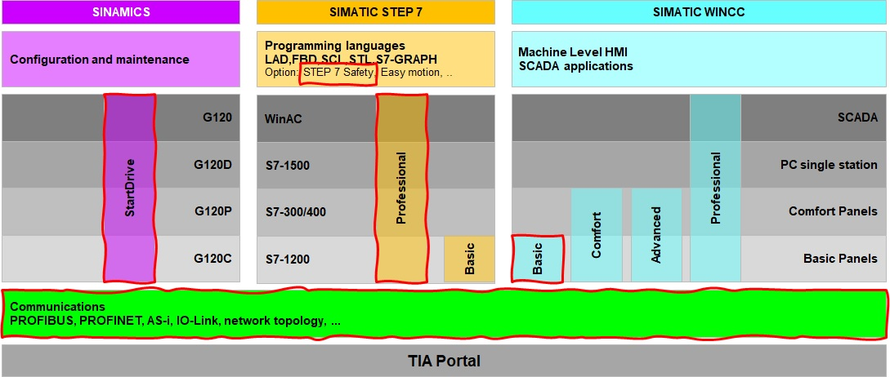
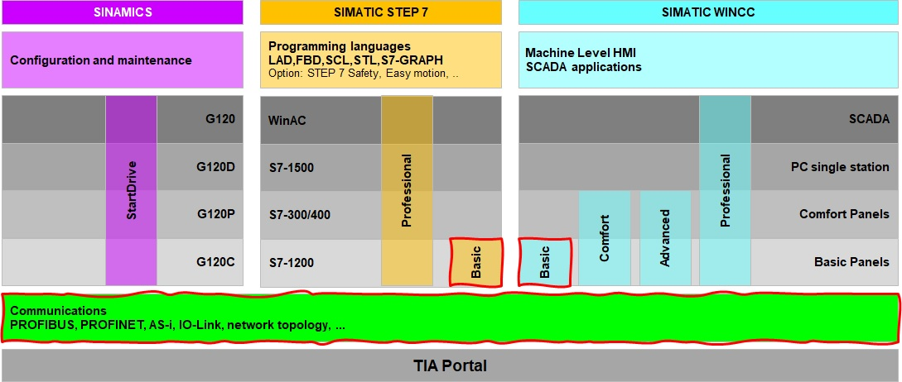
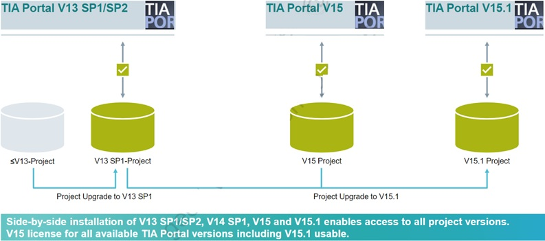

_____________________________________
# Introduction
With SIMATIC TIA Portal users configure, program, test and diagnose basic, advanced, distributed controllers and HMI panels, whether it is PLC- or PC-based, incl. software controllers. SIMATIC TIA Portal can be expand with supplements for configure, test and diagnose applications such as drives, network applications, ... .

SIMATIC TIA Portal is one of the core products of the TIA Portal engineering framework seamlessly integrated into one platform by using shared services as well as data.

# Siemens TIA Portal licensing
| **TIA Portal Basic** | **TIA Portal Professional** | **TIA Portal Options** |
|:--------------------:|:---------------------------:|:----------------------:|
|  |  |  |
| The subset of TIA Portal controller software for the basic controller S7-1200 | The comprehensive software solution for programming the controllers S7-1200, S7-1500, S7-300 and S7-400 with a fixed number of integrated functions | Functional supplements to the standard controller software, e.g. for failsafe applications or technological tasks |
| **Basic license** | **Professional license** | **Optional licenses**  |

Educational institutes benefit from special conditions such as **educational licenses** which are Professional licenses limited in time (356-days).

Basic licenses are often provided to educational institutes as it comes with basic controller packages. These licenses are not limited in time but they are limited in functionallity.

# TIA Portal versions
The TIA Portal platform is constantly evolving, resulting in different versions over the years. Upward compatibility from older versions is only possible according to the schedule below.

Downward compatibility is not supported.

# TIA Portal icons
TIA Portal can be started by double-clicking the TIA Portal icon. A new set of icons come with the installation of TIA Portal.

| **Icon** | **Description**   |
|:--------:|:------------------|
|   | To start TIA Portal V16 |
|   | To start the TIA Portal updater for installing updates |
|   | To open the license manager |
|  | To start the PLC simulator for S7-1200 & S7-1500 CPU’s |
|  | A TIA Portal file |
|  | To open the PC communication settings necessary for HMI simulation with a CPU where administration rights are necessary1 |

 1 Can be started from: "C:\Program Files\Common Files\Siemens\CommunicationSettings\CommunicationSettings.exe" 
