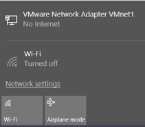
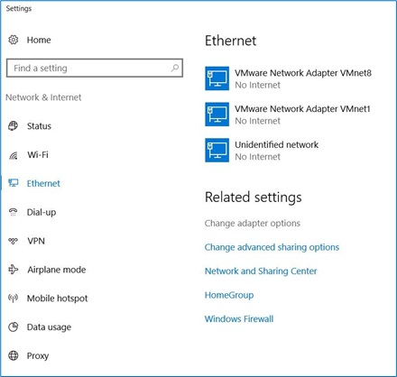
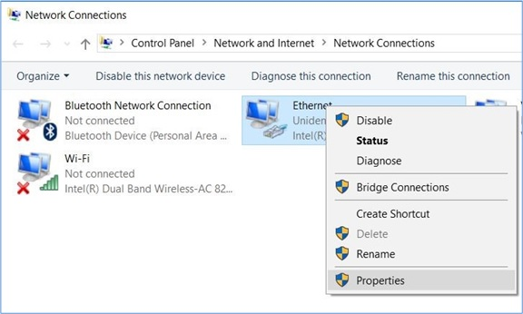
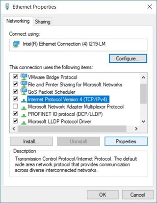

_____________________________________
# Setting the engineering station IP address
Before you can start to program a SIMATIC S7-1200 controller on a the PC, you need to setup a TCP/IP connection.

It is important that the IP addresses of both devices match for the PC and
SIMATIC S7-1200 to communicate with each other via TCP/IP.

* Locate the network icon  in the taskbar at the bottom and click on "Network settings".

* In the network settings window that opens, click on "Ethernet" and then on "Change adapter options".

* Select the desired "Local Area Connection" that you want to use to connect to the controller and click "Properties".

* Next, select "Properties" for "Internet Protocol Version 4 (TCP/IP)".

* You can now use the following IP address : **192.168.0.99** with Subnet mask **255.255.255.0**. Accept the settings by pushing the "OK" button.
