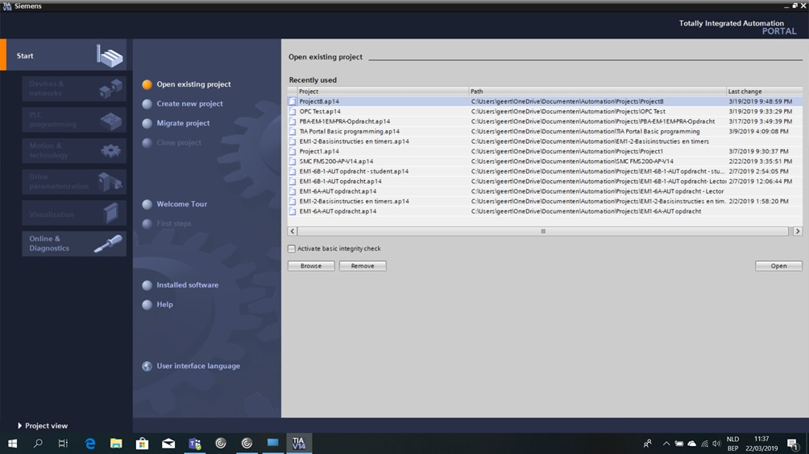
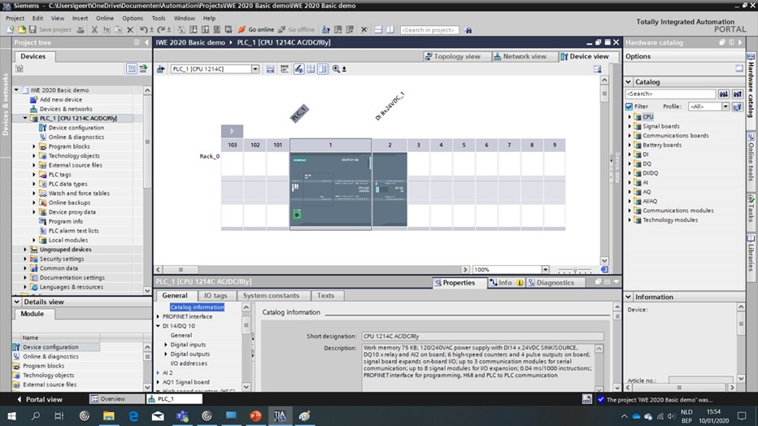
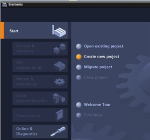
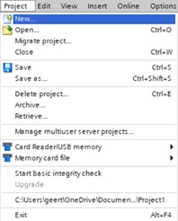
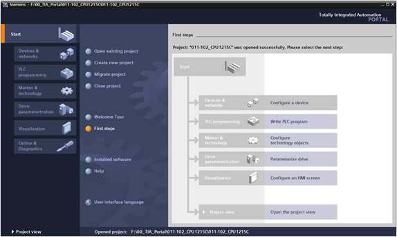
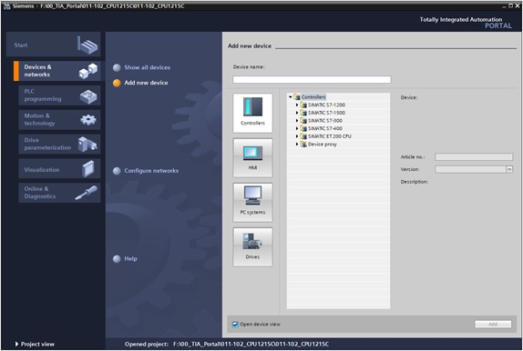
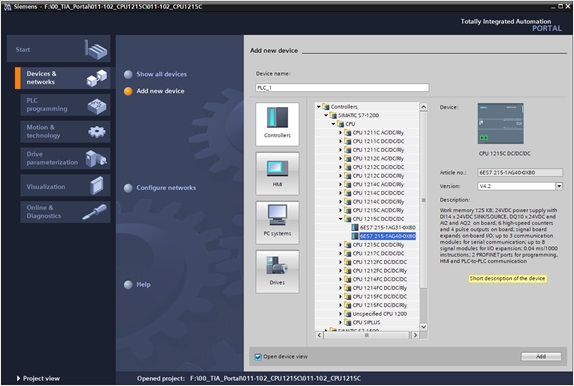

_____________________________________
# Starting
TIA Portal can be started, by double-clicking its icon, where the number in the icon refers to the version of TIA Portal.

TIA Portal can be started in 2 views:
- Portal view : Run through a wizard to add a device (**Default view**)
- Project view : To program and add devices (**Preferred view**)

The **Portal view** provides a task-oriented view of the tools for working on the project. Here, you can quickly decide what you want to do and open the tool for the task at hand. If necessary, a change to the project view takes place automatically for the selected task.

The **Project view** is used for hardware configuration, programming, creation of the visualization and many other tasks.

By default, the project view displays the menu bar with the toolbars at the top, the project tree with all components of a project on the left and the so-called task cards with instructions and libraries, for example, on the right.

If an element (for example, the device configuration) is selected in the project tree, it is displayed in the center and can be worked on there.

It is possible to switch between the 2 views by means of clicking the text "Project view" or "Portal view" at the bottom left.

# Create a new Project
A new project can be created in Portal or Project view.

Portal view  |  Project view
:--:|:--:
"Create new Project"  |  "Project" > "New..."
 | 

A project in the **Portal view** will be created after pushing the "Create" button and opened. The menu "Start", "First steps" will open automatically.

Push "Configure a device" in "Start" > "First steps" and switch to the "Add new device" menu.

Select the S7-1200 CPU for your project and click on "Add".

