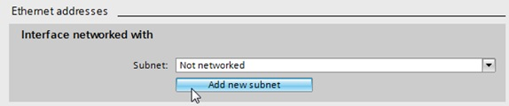

_____________________________________
# Add a new PLC Device to a project
## Portal view
The project will be created after pushing the "Create" button and opened. The menu "Start", "First steps" will open automatically.

Push "Configure a device" in "Start" > "First steps" and switch to the "Add new device" menu.

Select the S7-1200 CPU for your project and click on "Add".

## Project view
Double click on "Add new device" and select the S7-1200 CPU for your project.

Configure the device by double-click on “Device configuration” and selecting the CPU in the Device view. The properties can be configured in the Properties view.

# Add modules to a PLC Device
A PLC Device can be expanded with additional modules such as:
* Digital input modules to process digital sensors
* Digital output modules to control digital actuators
* Analog input modules to process analog sensors
* Analog output modules to control analog actuators
* Industrial network modules to process communication through Profibus, ProfiNET, etc.
* Other modules such as ..

The Siemens S7-1200 CPU is foreseen with an extra location for modules in the middle of the CPU. Additional modules for this location are called boards.

Modules and boards can be added to a PLC device by opening the "Device configuration" and to drag a module from the catalog to the CPU.
Allowed locations in the PLC rack are showed with a blue rectangle.

Each module and device can be configured in the "Properties" window of the "Device configuration" by selecting the item. Also some internal parts of a device can be configured this way.

For example: The ProfiNET/Ethernet port can be configured in the "Properties" window after selecting it.

Remark: Create a subnet if the CPU is not networked.

# Download hardware
Each change in the "Device configuration" must be transferred to the CPU. This is done by downloading the hardware. Compile your project before a download to check on faults.

A hardware download can be started from the toolbar

