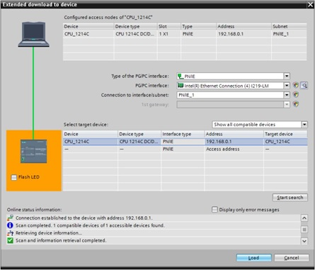

_____________________________________
# Hardware
Double click in the **Project view** on "Add new device" and select the S7-1200 CPU if you want to add a PLC to your project. Don't forget to check the order number on your PLC because it could be different then showed on the picture below.

Double-click on “Device configuration” in the device tree to add and configure device modules.

The TIA Portal project view contains different items. They can be switched on or off in the "View" menu.
1. Menu bar
2. Toolbar
3. Project tree
4. Editor area
5. Inspector window
6. Task card

The editor area contains the opened editors. The organization of these windows can be controlled by the "Window" menu in the menu bar.
The contents of the inspector window and task card depends on the selected item(s) in the Editor window.

# Add modules to a PLC Device
A PLC device can be expanded with additional modules such as:
* Digital input modules to process digital sensors
* Digital output modules to control digital actuators
* Analog input modules to process analog sensors
* Analog output modules to control analog actuators
* Industrial network modules to process communication through Profibus, ProfiNET, etc.
* Other modules ...

It is necessary to add the PLC device modules in the "Device configuration" so it match with the real situation. Also the configuration of the addresses can be done in the "Device configuration". It requires to open the "Device overview".

**Remark:** To show and hide the Device overview, you must click the small arrow next to "Device data" on the right side of the hardware configuration.

Modules and boards can be added to a PLC device by drag a module from the catalog and to drop it into the CPU. Allowed drop locations are showed with a blue rectangle.

**Remark:** The Siemens S7-1200 CPU is foreseen with an extra location for modules in the middle of the CPU. Additional modules for this location are called boards.

# Configure modules
Each module and device can be configured in the "Properties" window of the "Device configuration" by selecting the item. Also some internal parts of a device can be configured this way.

For example: The ProfiNET/Ethernet port can be configured in the "Properties" window after selecting it.

**Remark**: Create a subnet if the CPU is not networked.

# Download hardware
Each change in the "Device configuration" must be transferred to the CPU. This is done by downloading the hardware. Compile your project before a download to check on faults.

A hardware download can be started from the toolbar with the download icon  or by selecting the corresponding action in the "Download to device" menu after right clicking the CPU in the project tree. From this menu you can download:
* Hardware and software (only changes)
* Hardware configuration
* Software (only changes)
* Software (all)

TIA Portal will ask to select the interfact the first time you download the hardware. Select the ProfiNET/Ethernet interface that is connected with the CPU of the PLC. Continue by selecting the target device and by press the load button.

>**Remark:** The list of target devices can be updated by a press on the "Start search" button. The list will show all the devices corresponding the selected filter:
>* Show all devices - Show everything (so also for example PC's)
>* Show only compatible devices - Show only Siemens devices
>* Show only device with the same address - Show only the device with the address in the "Configured access nodes" field (at the top)

A download of hardware requires a change to the STOP mode. This change has to been confirmed! This is done in the "Load preview" window where you change the red text to "Stop all" in the "Action" column.

>**Remark:** In a real situation a STOP will lead to a total stop of the machine or technical installation. Only do this after stopping the machine or technical installation.

After a download TIA Portal will ask a confirmation to restart the PLC. Do this by selecting the "Start all" checkbox. Continue by clicking the "Finish" button.

