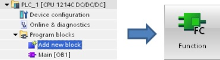
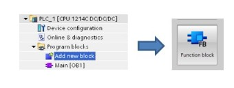
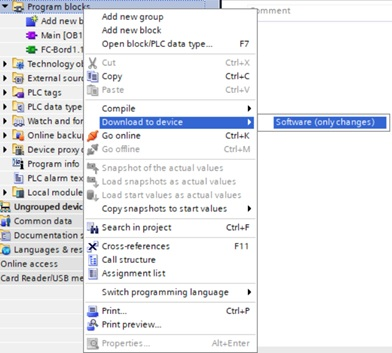

_____________________________________

## PLC software

Software code can be programmed into 'Program blocks' in 5 programming languages:

* Function Block Diagram (FBD)
* Ladder (LAD)
* Sequential Function Chart (SFC)
* Structured Text (ST)
* Structured Control language (SCL)

FBD, LAD and SFC are graphical based programming languages. This means that instructions are figures which can be connected. Each

### Organization blocks [OB]

### Functions [FC]

### Function Blocks [FB]

### Data Blocks [FB]

## PLC TAGs

BOOL, BYTE, WORD, DWORD & LWORD

## Download software

