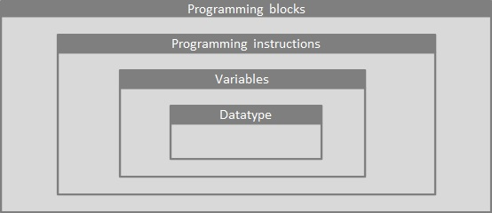
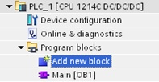
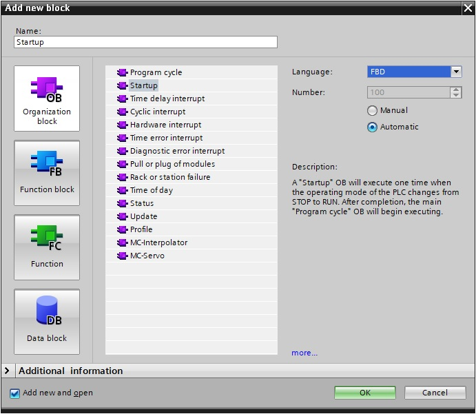
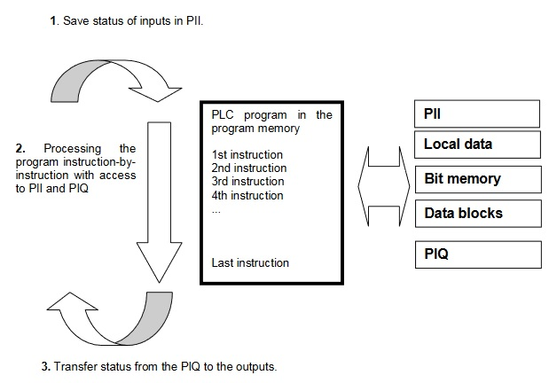
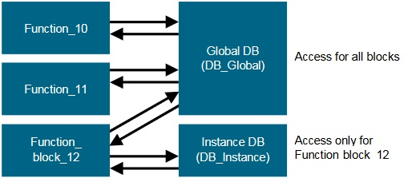
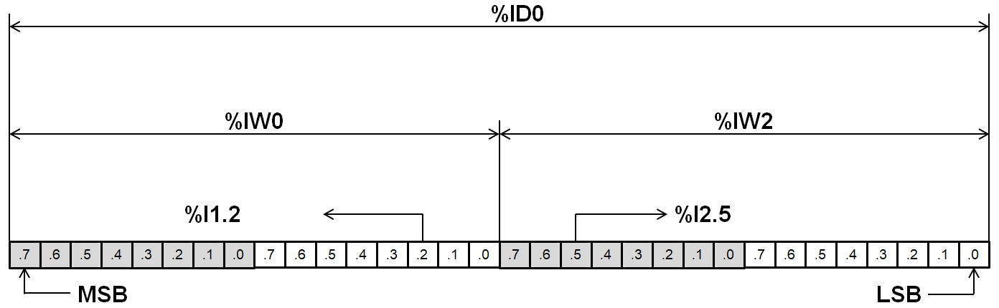

# Software
_____________________________________
## Programming languages
Software can be programmed into 'Program blocks' in 5 programming languages according the international standard IEC 61131-3:

* Function Block Diagram (FBD) 1
* Ladder (LD) 1
* Sequential Function Chart (SFC)
* Structured Text (ST) 1
* Instruction List (IL)

Within these languages it is possible to define 2 types:
* Graphical based programming languages
* Textual based programming languages

| Programming language | Example |
| :---:                | :---:   |
| LD   |   |
| FBD  |   |
| SFC  |   |
| ST   |   |
| IL   |   |

>1 Remark: Only the programming languages FBD, LAD and ST are allowed with Siemens S7-1200. Siemens uses the names Strucured Control Language (SCL) for Strucured text and LAD for ladder.

Each programming language comes with a set of programming instructions:
* Textual instructions for Textual based programming languages
* Graphical instructions combined with some static and/or dynamic text for graphical based programming languages

An instruction is combined with a variable, that on his way is defined by a data type, to create software code. In this way it is possible to develop strategies for the automatic functionallity of machines.

## Programming blocks
Their are 4 types of programming blocks available in TIA Portal which allow to organize software code:
- Organization blocks
- Functions
- Function blocks
- Datablocks

### Organization blocks [OB]
Program organization units, also organization blocks called, are activated on a certain event. Every other block type (FC, FB or DB) is orginally initiated form an organization block. In this way they form the interface between the operating system of the controller (CPU) and the application program (software code).

In Siemens TIA Portal these blocks are abbrevate with the letters OB. After the letters OB comes an unique number. The number itselfs defines its function, for example:
- OB1 = **Main**, the main block where you place instructions that are executed non-stop if the operating mode of the CPU=RUN
- OB10 = Time-of-day interrupt, start programs at a specific time
- OB30 = Cyclic interrupt, start programs at periodic intervals
- OB100 = Startup, execute one time when the operating mode of the CPU changes from STOP to RUN

Notice that that Main block OB1 always available is; it comes with the creation of a new project.

Blocks can be added from the TIA Portal project tree with the command "Add new block".

A popup screen will be showed by doubleclicking on "Add new block". In this screen it is possible to select a type of programming block and the programming language. The block will be generated the moment the OK button is pushed. Afterwards it is not possible the change the programming language except for LAD & FDB.

A programming block can be opened by doubleclicking on it in the project tree. The programming interface depends on the programming Language:
* Networks are showed for graphical programming languages
* Instruction lines with unique numbers are showed for textual programming languages

At the top of each block (except for datablocks) is a block interface,  independed from the programming language. It allows you to create external block interface signals.

### Process image and cyclic program processing
When the cyclic user program addresses the inputs (I) and outputs (Q),  it does not query the signal states directly from the input/output  modules. Instead, it accesses a memory area of the CPU. This memory area contains an image of the signal states and is called the **process image**.

The cyclic program processing sequence is as follows:
1. At the start of the cyclic program, a query is sent to determine  whether or not the individual inputs are energized. This status of the inputs is stored in the **process image of the inputs (PII)**. In doing so, the information 1 or "High" is stored for energized inputs and the information 0 or "Low" for de-energized inputs.
2. The CPU then executes the program stored in the cyclic organization block. For the requiredinput inform ation, the CPU accesses the previously read **process image of the inputs (PII)** and the results of logic operation (RLOs) are written to a so-called **process image of the outputs (PIQ)**.
3. At the end of the cycle, the **process image of the outputs (PIQ)** is transferred as the signalstate to the output modules and these are  energized or de-energized. The sequence then continues again with item 1.

**NOTE** : The time the CPU needs for this sequence is called cycle time. This depends, in turn, on the number and type of instructions and the processor performance of the controller.

### Functions [FC]
Functions (FCs) are logic blocks without memory. They have no data memory in which values of block parameters can be stored. Therefore, all interface parameters must be connected when a function is called. To store data permanently, global data blocks must be created beforehand.

A function can be added with the "Add new block" command from the project tree.

A function contains a program that is executed whenever the function is called from another logic block.

Functions can be used, for example, for the following purposes:
- Math functions – that return a result dependent on input values.
- Technological functions – such as individual controls with binary logic operations.

A function can also be called several times at different points within a program.

### Function Blocks [FB]
Function blocks are logic blocks that store their input, output and in-out tags as well as static tags permanently in instance data blocks, so that they are available after the block has been executed. For this reason, they are also referred to as blocks with "memory".

Function blocks can also operate with temporary tags. Temporary tags are not stored in the instance DB, however. Instead, they are only available for one cycle.

Function blocks are used for tasks that cannot be implemented with functions:
-	Whenever timers and counters are required in the blocks, or
-	When information must be stored in the program, such as preselection of the operating mode with a button.

Function blocks are always executed when called from another logic block. A function block can also be called several times at different points within a program. This facilitates the programming of frequently recurring complex functions.

A call of a function block is referred to as an instance. Each instance of a function block is assigned a memory area that contains the data that the function block uses. This memory is made available by data blocks created automatically by the software.

A function block can be added with the "Add new block" command from the project tree.

### Data Blocks [DB]
In contrast to logic blocks, data blocks contain no instructions. Rather, they serve as memory for user data.

Data blocks thus contain variable data that is used by the user program. You can define the structure of global data blocks as required.

A global data block can be added with the "Add new block" command from the project tree. **Don't mix global data blocks** up **with instance data blocks** as they look the same but they are created automatically by a function block (FB).

Global data blocks store data that can be used by all other blocks. Only the associated function block should access instance data blocks. The maximum size of data blocks varies depending on the CPU.

Application examples forglobal data blocks are:
- Saving of information about a storage system. "Which product is located where?"
- Saving  of  recipes  for  particular  products.

The data in data blocks is stored retentively in most cases. This data is then retained in the event of a power failure or after a STOP/START of the CPU.

## PLC Tags
A PLC Tag is defined by a data type and is used to combine programming instructions with other PLC Tags and/or constant values. Within TIA Portal you can define a PLC TAG with
- An direct address
- An symbolic address

### Direct addresS
A direct address always contains:
- % sign
- Operand
- Range
- Unique number or combination of numbers

The operand creates a link to a certain area of the CPU. For example it is possible to create a link to the process image of inputs.

| Operand | Description |
|:---:    |:---:        |
| I       | Input area  |
| Q       | Output area |
| M       | memory area |

The range determines the bit size of a PLC Tag.

| Range | Size (bits) | Description |
|:---:  |:---:        | :---       |
| X     | 1 bit       | BOOL (X only used in DB) |
| None  | 1 bit       | BOOL       |
| B     | 8 bits      | BYTE  = sequence of 8 bits  |
| W     | 16 bits     | WORD  = sequence of 16 bits |
| D     | 32 bits     | DWORD = Double WORD = sequence of 32 bits |
| L     | 64 bits     | LWORD = Long WORD = sequence of 64 bits |

The unique address is create by means of a byte start address. In case of a 1 bit PLC TAG the byte number is fullfilled with a "." and a bit number between 7 to 0.

Within a byte is the sequence of bits is determined where
- Bit 8 has to heighest weight and is called the **most significant bit**
- Bit 1 has to lowest weight and is called the **least significant bit**

| BIT | 8 | 7 | 6 | 5 | 4 | 3 | 2 | 1 |
| :---: | :---: | :---: | :---: | :---: | :---: | :---: | :---: | :---: |
| ADDRESS  | .7  | .6  | .5  | .4  | .3  | .2  | .1  | .0  |
| WEIGHT   | MSB |   |   |   |   |   |   | LSB   |

Bytes in a Siemens controller are ordered following the Big Endian principle. This is different from PC systems because they mostely follow the Little Endian principle.

__Examples__:
-	%Q8.0	: Bit 0 on output byte 8
-	%MD48	: Double memory word starting at byte 48
-	%QB8	: Output byte 8

### Symbolic address

### Data types
Data types are used to determine the "value" of a sequence of bits. Because what does the binaire value "1010 1010" of a byte means?

Does it represent
- A numeric value of 170?
- A numeric value of -86?
- The character "a"?

This is determined by assigning a data type to a PLC Tag.

| Data type | Size (bits) | Display |
|:---:      |:---:        |:---:  |
| BOOL      | 1           | 0 to 1|
| BYTE      | 8           | ---   |
| WORD      | 16          | ---   |
| DWORD     | 32          | ---   |
| LWORD     | 64          | ---   |
| SINT      | 8           | -(28-1) .. (28-1) – 1  |
| INT       | 16          | -(216-1) .. (216-1) – 1 |
| DINT      | 32          | -(232-1) .. (232-1) – 1 |
| LINT      | 64          | -(264-1) .. (264-1) – 1  |
| USINT     | 8           | 0 .. (28) – 1 |
| UINT      | 16          | 0 .. (216) – 1 |
| UDINT     | 32          | 0 .. (232) – 1 |
| ULINT     | 64          | 0 .. (264) – 1 |
| REAL      | 32          | -3.40E+38 .. -1.18E-38 and 1.18E-38 .. 3.40E+38 |
| LREAL     | 64          | -1.80E+308 .. -4.94E-324 and 4.94E-324 .. 1.80E+308 |
| TIME      | ---         | T#0s            |
| DATE      | ---         | D#1997-12-01    |
| TIME_OF_DAY or TOD | ---| TOD#23:59:59    |
| DATE_AND_TIME or DT| ---| DT#1997-12-01-23:59:59 |
| CHAR      | 8           | ASCII chacter |
| STRING    | Variable    | Range of 8 bits ASCII characters  |
| WSTRING   | Variable    | Range of 16 bits ASCII characters |

**NOTE** : Data types with a size of 64 bit are not supported by S7-1200 CPU's

Data types are often combined in groups as showed in the next table.

| Groep    | Contains the data types         |
| :---:    | :---:                           |
| ANY_NUM  | SINT, INT, DINT, LINT, USINT, UINT, UDINT, ULINT, REAL, LREAL  |
| ANY_INT  | SINT, INT, DINT, LINT, USINT, UINT, UDINT, ULINT |
| ANY_REAL | REAL, LREAL |
| ANY_WORD | WORD, DWORD, LWORD |
| ANY_STRING  | STRING, WSTRING |

## Download software

