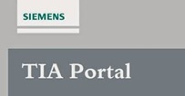

_____________________________________
# PLC software
## Programming languages
Software can be programmed into 'Program blocks' in 5 programming languages according the international standard IEC 61131-3:

* Function Block Diagram (FBD) 1
* Ladder (LD) 1
* Sequential Function Chart (SFC)
* Structured Text (ST) 1
* Instruction List (IL)

Within these languages it is possible to define 2 types:
* Graphical based programming languages
* Textual based programming languages

| Programming language | Example |
| :---:                | :---:   |
| LD   |   |
| FBD  |   |
| SFC  |   |
| ST   |   |
| IL   |   |

>1 Remark: Only the programming languages FBD, LAD and ST are allowed with Siemens S7-1200 where strucured text is called Strucured Control Language (SCL) and ladder is abbrevated by LAD.

Each programming language comes with a set of programming instructions:
* Textual instructions for Textual based programming languages
* Graphical instructions combined with some static and or dynamic text for graphical based programming languages

An instruction is combined with a variable, that on his way is defined by a datatype, to create software code. In this way it is possible to develop strategies for the automatic functionallity of machines.

## Programming blocks
### Organization blocks [OB]
Program organization units, also organization blocks called, maintain .

In Siemens TIA Portal these blocks are abbrevate with the letters OB. After the letters OB comes an unique number. The number itselfs defines its function, for example:
- OB1 = **Main**, the main place where you place instructions that are executed non-stop if the operating mode of the CPU is RUN
- OB10 = Time-of-day interrupt, start programs at a specific time
- OB30 = Cyclic interrupt, start programs at periodic intervals
- OB100 = Startup, execute one time when the operating mode of the CPU changes from STOP to RUN

Blocks can be added from the TIA Portal project tree with the command "Add new block".

A popup screen will be showed by doubleclicking on "Add new block". In this screen it is possible to select a type of programming block and the programming language. The block will be generated the moment the OK button is pushed. Afterwards it is not possible the change the programming language except for LAD & FDB. It is possible to switch to programming language of block for LAD to FBD (and back).

A programming block can be opened by doubleclicking on it in the project tree. The programming interface depends on the programming Language:
* Networks are showed for graphical programming languages
* Instruction lines with unique numbers are showed for textual programming languages

There is a block interface for each programming block independed from the programming language.

### Functions [FC]

### Function Blocks [FB]

### Data Blocks [FB]

## PLC TAGs

BOOL, BYTE, WORD, DWORD & LWORD

## Download software

