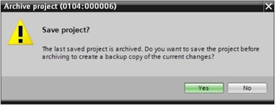

_____________________________________
# Offline fault diagnostics
Faults can be caused by a variety of things. For **faults** that occur **after a changeover to RUN**, there are two error patterns.  

1.	The **CPU** goes to or stays in the **STOP operating state**. The yellow STOP LED lights up and other indicator LEDs light up on the CPU, power supply unit, IO modules or bus modules.  
A CPU fault is present in this case. For example, a module in the automation system might be defective or have an incorrect parameter assignment or a bus system fault might be present.  
An interruption analysis will be performed in this case by evaluating the hardware diagnostics and by reading the module information from the diagnostic buffer of the CPU.    

2.	The **CPU** is in a **faulty RUN operating state**. The green RUN LED lights up and other indicator LEDs light up or flash on the CPU, power supply unit, IO modules or bus modules.  
In this case, a fault may be present in the IO devices or power supply.
A visual check will be performed initially to narrow down the fault area. The indicator LEDs on the CPU and IO devices will be evaluated. The diagnostic data of the faulty IO and bus modules will be read from the hardware diagnostics. In addition, a fault analysis can be performed using a watch table on the programming device.

# Online diagnostics
Online diagnostics can only be performed when the correct communication connection to the CPU has been established.

To get started with the diagnostic functions, select your controller in the project and click "Go online".

 We connect via Ethernet/PROFINET in this case. When going online, you must therefore set the appropriate interfaces for your automation system.

The orange project tree bar indicates that the connection is established and are working ONLINE. The CPU can be started or stopped with the buttons .

**Operating state symbols for CPUs and CPs**
The graphical representation and device information window show the various
operating states of the CPU or communication processors (CPs).

**Icon** | **Description**   |
|:--------:|:------------------|
|  | RUN          |
| | STOP |
|  | STARTUP |
|  | HOLD |
|  | DEFECT |
|  | unknown operating state |
|  | The configured module does not support display of the operating state |

## Online hardware diagnostics
The device view in online mode of the TIA Portal gives you a quick overview of the configuration and system status of the automation system.

**Diagnostic symbols for modules and devices in the device overview**
The graphical representation and device overview window show the operating states of the various modules, CPU or communication processors (CPs) using the following symbols.

| **Icon** | **Description**   |
|:--------:|:------------------|
|  | No error          |
| | Maintenance needed |
|  | Maintenance necessary |
|  | Error, maintenance necessary |
|  | The device or module is deactivated |
|  | The device or module cannot be reached |
|  | No input and/or output data available |
|  | There is no diagnostic data available because the online and offline configurations are different |
|  | The device or module is available but is not compatible |
|  | There is a connection with the device or module but state is unknown |
|  | There is a connection with the device or module but diagnostic is not allowed |
|  | Hardware fault, **can be showed in combination with other icons** |

## Online diagnostics for program blocks
The project tree window of the TIA Portal in online mode gives you an overview
of the programmed blocks of the user program. A comparison of the program blocks used offline and online is displayed with the help of diagnostic symbols.

**Symbols for the comparison status in the project tree**
The diagnostic symbols in the project tree show a comparison status representing the online/offline comparison of the project structure.

| **Icon** | **Description**                                                   |
|:---------:|:------------------------------------------------------------------|
| | Software error, **can be showed in combination with other icons** |
|  | There is a difference between the online and offline block        |
|  | Block only exist in the online version                            |
|  | Block only exist in the offline version                           |
|  | The offline and online blocks are equal                           |

The desired block must be open for monitoring the downloaded program. The monitoring can be activated/deactivated by clicking the  icon.

If a particular point of use of a block is to be monitored, the call environment can be selected using the  icon.

# Monitor and modify tags
To monitor and modify tags, you need a watch table. This is done by double-click "Add new watch table" in the project tree.

Open the newly created watch table by double-clicking it. You can enter individual tags in the table by typing the tagname or by typing the absolute address. A comment line can be added by using "//" before the comment.

Go online with the "Go online" button  and activate the monitor function with the "Monitor" button .

**PICTURE ONLINE**

# Online/offline comparison
It is often important to know whether the saved data matches the data loaded
in the controller. To compare, right-click the controller in the project tree and select "Compare", "Offline/online".

The compare editor online opens.

If, for example, block differences are indicated  , first select the block involved. You can then click the  button to "Start detailed comparison".

The selected offline/online block will be compared in the code block
comparison. A detailed description of the difference is shown in the
comparison result.

# Restoring the factory settings
Sometimes it is necessary to restore the factory settings

>Examples :
>* Download of a program to a CPU with a different TIA Portal version
>* IP-address could not be assigned

A restore to factory settings is accomplished by the "Online access" in the project tree where you start the "Update accessible devices" in the network card of your PC connected to the PLC.

As result all accessible devices will be showed in the project tree with there IP-address or mac-address (only when the device has no IP-address).
Open the local tree of the PLC you whish to restore.

Double click on the "Online & diagnostics" item to open the online editor.
Select the "ProfiNET interface [X1]" menu under "Diagnostics" and click on "LED Flashes".

As result the diagnostic LEDs on the CPU will flash (to be sure you have selected the right PLC). Open the "Functions" menu and select "Reset factory settings".

The reset to factory settings is started by clicking the "Reset" button (followed with confirmation). You can choose before the reset to retain or to delete the current IP-address.

# Backup
It is possible to create a backup of your project by archiving it.
An **archive** is a TIA Portal ZIP file a can only be opened by retrieving the file.

| **File type** | **Description**                                                    |
|---------------|--------------------------------------------------------------------|
| .ZAP16      | TIA Portal ZIP archive of a V16 project                          |
| .ZAL16      | TIA Portal ZIP archive of a V16 library                          |
| .AP16       | TIA Portal project V16 (1) |
| .AL16       | TIA Portal library V16 (1) |

1 *!! Cannot be used as standalone file !!*

> **Remark** : It is recommended to make backups and to save it on a secondary location so the project can be retrieved in case of lost.

To archive the project, select the "Archive ..." command in the "Project" menu.

Confirm the prompt to save the project with "Yes".

Select a folder where you want to archive your project and save it as a "TIA Portal project archive" file type.
