# PLC board introduction
_____________________________________
## General
The main goal of this exercise is to discover the installed equipment on the board and how the use the board.

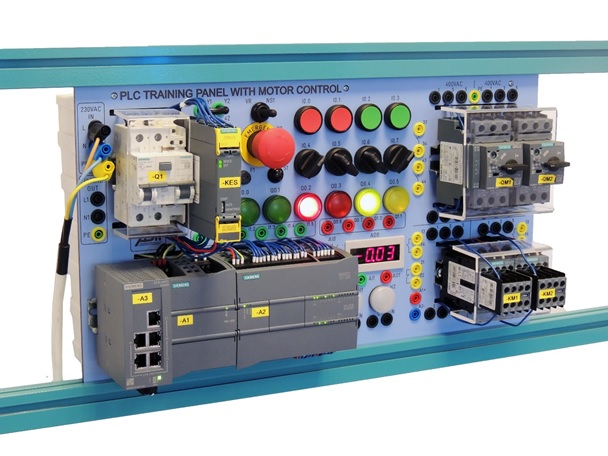

The PLC with Motor Control Training Panel is a powerful didactic tool used both
in academic and industrial courses. Through its enhanced performance and
usability, the PLC with Motor Control Training Panel is one of the best examples
of productivity and innovation for device configuration and programming via the
Totally Integrated Automation Portal software.

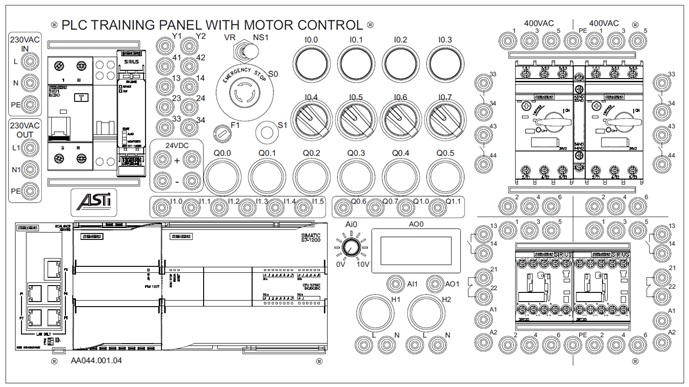

The board is equipped with
* A main power switch to cutoff the power
* A Siemens PLC from the S7-1200 family
* Human machine interfaces such as buttons, switches, lamps, potentiometer and an analog scale
* Electrical banana connectors
* 400 VAC electrical power components
* Emergency stop components

## Power supply
### General
The power supply of the board can be divided in 2 parts:
* 230VAC power supply components
* 24VDC power supply components

### 230VAC Power supply
The board is connected by a **230VAC** power chord to the mains and internally connected to the main switch which is a **differential circuit breaker**. Its basic functions are:
* To protect circuits from damage caused by excess current from overload or short circuit (In)
* To protect humans against electrocution (Idiff)

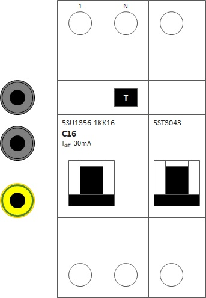

So what are the specifications of this differential circuit breaker?
* The number **16** in C16 means that a rated current In of 16A or less is allowed
* The letter **C** in C16 means that a current 5 to 10 times the rated current In is allowed during 100 ms or less
* The Idiff=30mA means that a difference between the ingoing and outgoing current (L1 & N) of 30 mA or less is allowed
* The differential circuit breaker will cutoff power if it detects a condition that is not allowed
* It comes with an optional launch coil at the right which will cutoff power if the emergency button on the board is pressed in NS1 mode

| Banana connection | Description |
| :---: | :--- |
| Black | 230VAC controlled by main power switch  |
| Yellow | Protective earth [PE]|

>**Where is that leak current difference going to?**  
**Answer:** To the earth and it can go through humans which can cause significant injuries or even dead if no protective device is installed. 
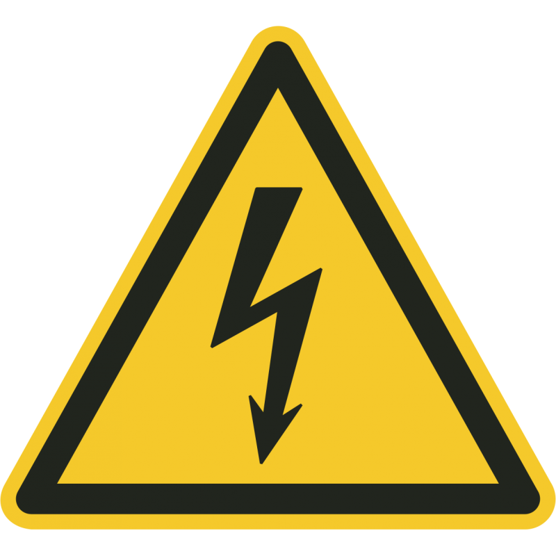  
The differential circuit breaker prevents the existing of leak currents higher than 30 mA.

### 24VDC Power supply
A **24VDC self-regulated power supply** is used on the board to create the control circuits by converting unregulated 230VAC to constant 24VDC even if there is a fluctuation at the 230VAC.

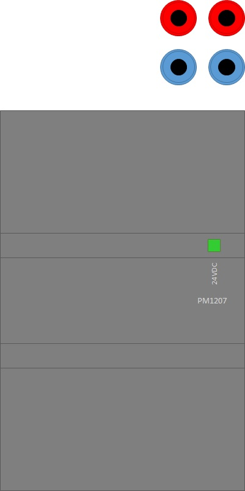

The 24VDC power supply will be activated if the main power supply is switched on. The 24VDC circuit is protected against overload and short circuit with a fuse which is mounted in a black fuse holder.

| Banana connection | Description |
| :---: | :--- |
| Red | 24VDC  |
| Blue | 0VDC |

>**What is a self-regulated power supply?**  
**Answer:** Voltage fluctations on the primary side will not effect the secondary, outgoing voltage. 

## Ethernet switch
An **ethernet switch** is networking hardware that connects devices on a "computer network" by using packet switching to receive and forward data to the destination device. Unlike a repeater hub a network switch forwards data only to the devices that need to receive it.

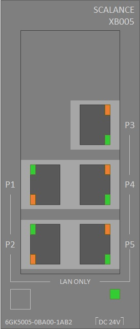

**Networking cables** are networking hardware used to connect one network device to other network devices. The cables foreseen with the board are shielded twisted-pair ethernet cables with RJ45 connectors.

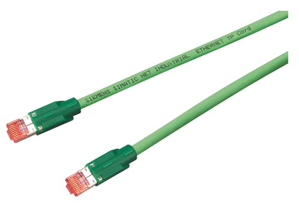

## Compact Siemens CPU
The modular Siemens S7-1200 controller is a **compact CPU** with integrated IO and communication interfaces that meet the highest industry requirements and a range of powerful integrated technological functions make this controller an integral part of a comprehensive automation solution.

The SIMATIC S7-1215C controller, installed on the board, has 14 24VDC digital inputs, 10 24VDC digital outputs, 2 [0..10V] analog inputs, 2 [0..20mA] analog outputs and 2 ethernet ports.

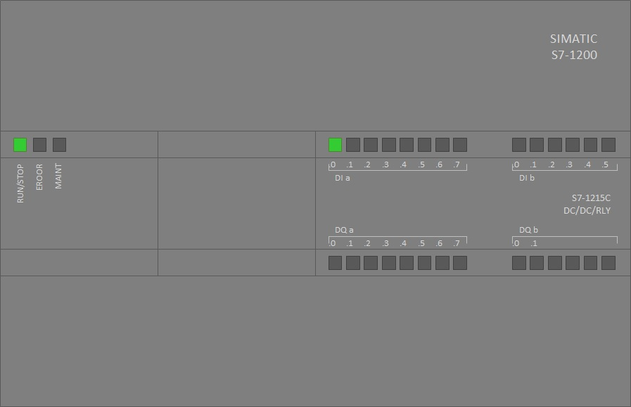

The state of the digital inputs and outputs can be monitored on the CPU by LEDs. The LED will be green if a digital signal is TRUE.

The state of CPU is visualized by means of the general state LEDs.

| LED | Color | Description |
| :---: | :--- | :--- |
| RUN/STOP | Continuous green | CPU in RUN |
| RUN/STOP | Blinking green | CPU is starting up |
| RUN/STOP | Continuous orange | CPU in STOP |
| ERROR | Red | Critical error |
| MAINT | Orange | Non-critical error |

## Human machine interfaces
The board is foreseen with multiple interfaces which make it possible to operate and to view the state of the automated technical installation.

The collection of these interfaces such as buttons, selector switches, lamps, potentiometer, etc. are called HMI (**Human Machine Interface**). This can be extended with a programmable display which is called an HMI-display.

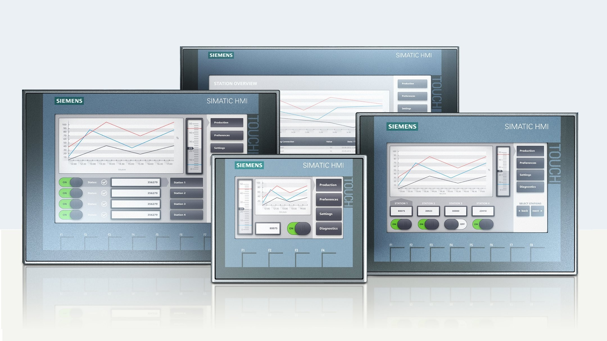

A selection of buttons, selector switches, potentiometer, lamps, etc. is foreseen on the board. You find them in the middle of the board.

| Element | Description |
| :---: | :--- |
| Green button | Normally open push button connected to a digital input |
| Red button | Normally closed push button connected to a digital input |
| Black selector | 2-state selector switch (fixed positions) connected to a digital input |
| Green lamp | Green LED lamp connected to a digital output |
| Yellow lamp | Yellow LED lamp connected to a digital output |
| Red lamp | Red LED lamp connected to a digital output |
| Potentiometer | 10-rotations knob for 0..12VDC analog input control |
| Analog scale | 0..10VDC analog scale connected to an analog output |

It is possible to add extra HMI components, sensors or actuators to the PLC in- & outputs by means of the banana connectors.

| Banana connection | Description |
| :---: | :--- |
| Green (below selector switches) | 24VDC digital inputs |
| Green (beside potentiometer)| 0..10VDC analog input |
| Red | 24VDC digital outputs |

## Safety relay
Safety circuits are used to stop actuators on a controlled way only in case of an emergency. At least on emergency button is foreseen which can avoid real or imminent dangers.

The **safety relay**, the safety banana connectors, the **emergency button** and the **reset button** can be found at the right from the main switch. Only the safety relay is connected to banana connectors.

| Mode | Description |
| :---: | :--- |
| NS1 | Safety relay OFF; the main switch will cut off power if the emergency button is pressed  |
| VR | Safety relay ON; the safety relay will cut off power if the emergency button is pressed (requires additional banana connections) |

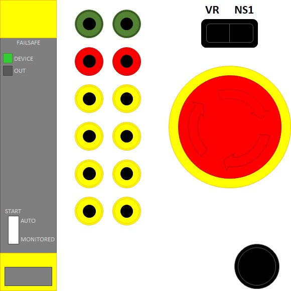

| Banana connection | Description |
| :---: | :--- |
| Green | 24VDC safety relay reset circuit [T4-IN F/S] |
| Red | 1x normally open control circuit [41-42] |
| Yellow | 3x normally open safety circuit [13-14] & [23-24] & [33-34] |

>**To deactivate an emergency state**
* Check why the emergency button is pressed and who pressed it
* Check if it is save to deactivate the emergency state
* Release the emergency button (turn and pull the button)
 * In NS1 Mode : Switch on the main switch
 * In VR mode : Press the black reset button under the emergency button (safety reset circuit must be closed!)

## Motor circuit breakers
A motor circuit breaker is an automatically operated electrical switch designed to protect an electrical motor from damage caused by excess current from an overload or short circuit. Its basic function is to interrupt current flow after a fault is detected. Unlike a fuse, which operates once and then must be replaced, a circuit breaker can be reset (either manually or automatically) to resume normal operation.

The **motor circuit breakers** can be found at the top right of the board. Each motor circuit breaker on the board is extended with an auxiliary switch that contains 2 contacts (33-34 / 41-42).

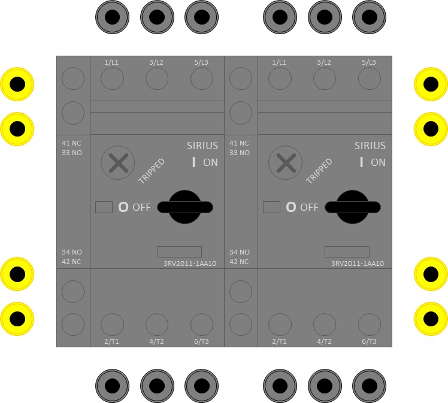

| Banana connection | Description |
| :---: | :--- |
| Black | 400VAC (230VAC) power circuits  |
| Yellow | 24VDC control circuits [33-34] & [41-42] |

A motor circuit breaker on the board can be switched on by turning the turnkey to the state '**I** ON'. Turn the turnkey to the state '**O** OFF' to switch off a motor circuit breaker. In case of malfunction, short circuit or overload, the turnkey will be in the state 'TRIPPED'.

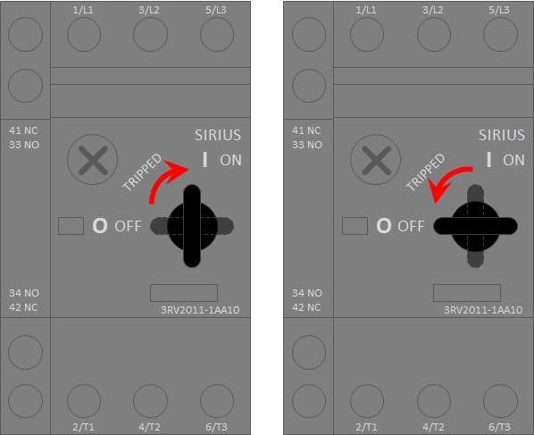

>**Working with motor circuit breakers**
>* Lock a motor circuit breaker with a padlock in case of electrical maintenance
>* If the motor circuit breaker is switched off; check why and by who the circuit breaker is switched off
>* If the motor circuit breaker is tripped; check the normal function of the connected motor
>* Check if it is save to switch on the motor circuit breaker and then switch it on

## Motor contactors
A **contactor** is an electrically-controlled switch used for switching an electrical power circuit. A contactor is typically controlled by a circuit which has a much lower power level than the switched circuit, such as a 24VDC coil electromagnet controlling a 400VAC motor switch.
Unlike relays, contactors are designed to be directly connected to high-current load devices.

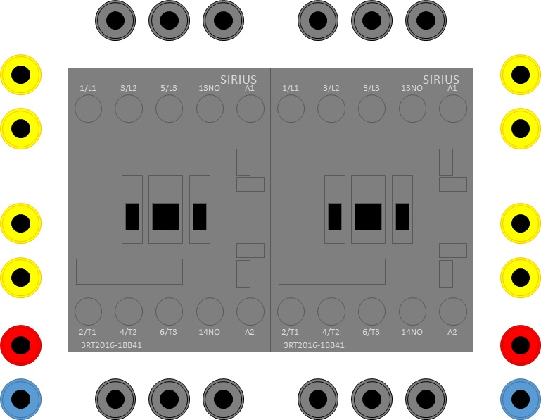

| Banana connection | Description |
| :---: | :--- |
| Black | 400VAC (230VAC) power circuits  |
| Yellow | 24VDC control circuits [1x NO] & [1x NC]  |
| Red | 24VDC coil contact [A1] |
| Blue | 0VDC coil contact [A2] |
