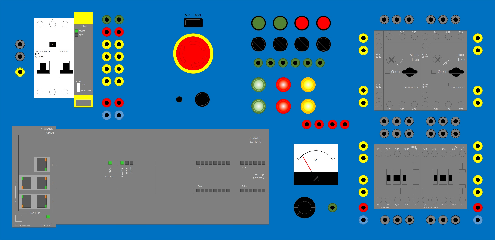

# Questions
_____________________________________

| Student tasks |
| :--- |
| Draw a rectangle around the main circuit breaker |  |
| Draw a oval with the text 'DI' around the digital input LEDs on the PLC|
| Draw a oval with the text 'DQ' around the digital output LEDs on the PLC|
| Draw a circle around the potentiometer|
| Draw a blue circle around all the 0VDC connectors |
| Draw a red circle around all the 24VDC connectors |
| Draw a cloud around all the contactors |  |
| Draw a square around all the contactor coil connections |  |
| Draw an oval around all the normally open & normally closed contact contactor connections |  |

| Student tasks | Answer |
| :--- | :--- |
| What does DC/DC/DC means on the Siemens CPU?|  |
| What is the incoming tension on the Siemens power supply?|  |
| What is the outgoing tension on the Siemens power supply?|  |
| How many ethernet connections has the switch? |  |
| How many digital inputs has the CPU? |  |
| How many analog inputs has the CPU? |  |
| How many digital outputs has the CPU? |  |
| How many analog outputs has the CPU? |  |
| Which color of banana chords do we use for 400VAC? |  |
| Which color of banana chords do we use for 230VAC? |  |
| Which color of banana chords do we use for 24VDC? |  |
| Which color of banana chords do we use for 0VDC? |  |
| What means C16 on the circuit breaker? |  |
| What means Idiff=30 mA on the differential circuit breaker? |  |
| Which color of banana chords do we use for 400VAC? |  |
| Which color of banana chords do we use for A+ connection of a contactor coil? |  |
| Which color of banana chords do we use for A- connection of a contactor coil? |  |
