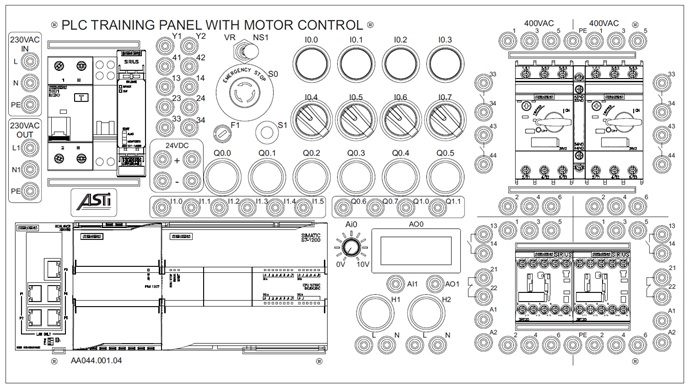

_____________________________________
# Questions

| Student tasks |
| :--- |
| Draw a rectangle around the main circuit breaker |  |
| Draw a oval with the text 'DI' around the digital input LEDs on the PLC|
| Draw a oval with the text 'DQ' around the digital output LEDs on the PLC|
| Draw a circle around the potentiometer|
| Draw a blue circle around all the 0VDC connectors |
| Draw a red circle around all the 24VDC connectors |
| Draw a cloud around all the contactors |  |
| Draw a square around all the contactor coil connections |  |
| Draw an oval around all the normally open & normally closed contact contactor connections |  |

| Student tasks |
| :--- |
| What does DC/DC/relay means on the Siemens CPU?|
| What is the incoming tension on the Siemens power supply?|
| What is the outgoing tension on the Siemens power supply?|
| How many ethernet connections has the switch? |
| How many digital inputs has the CPU? |
| How many analog inputs has the CPU? |
| How many digital outputs has the CPU? |
| How many analog outputs has the CPU? |
| Which color of banana chords do we use for 400VAC? |
| Which color of banana chords do we use for 230VAC? |
| Which color of banana chords do we use for 24VDC? |
| Which color of banana chords do we use for 0VDC? |
| What means C16 on the circuit breaker? |
| What means Idiff=30 mA on the differential circuit breaker? |
| Which color of banana chords do we use for 400VAC? |
| Which color of banana chords do we use for A+ connection of a contactor coil? |
| Which color of banana chords do we use for A- connection of a contactor coil? |

	
Click here to show the correct answers
<!-- Empty line after this one needed, do not delete! -->

| Student tasks | Answer |
| :--- | :--- |
| What does DC/DC/relay means on the Siemens CPU?| 24VDC power supply / 24VDC input signals / relay output signals  |
| What is the incoming tension on the Siemens power supply?| The incoming tension is 230VAC |
| What is the outgoing tension on the Siemens power supply?| The outgoing tension is 24VDC |
| How many ethernet connections has the switch? | Thw switch has 5 ethernet connections |
| How many digital inputs has the CPU? | The CPU has 14 digital inputs |
| How many analog inputs has the CPU? | The CPU has 2 analog inputs (0-10VDC) |
| How many digital outputs has the CPU? | The CPU has 10 digital outputs |
| How many analog outputs has the CPU? | The CPU has 2 analog outputs (0-20mA) |
| Which color of banana chords do we use for 400VAC? | We use **black**, **brown** and **grey** colored banana chords |
| Which color of banana chords do we use for 230VAC? | We use **bacl** and **brown** colored banana chords |
| Which color of banana chords do we use for 24VDC? | We use **red** colored banana chords |
| Which color of banana chords do we use for 0VDC? | We use **blue** colored banana chords |
| What means C16 on the circuit breaker? | A current higher than 16A is not allowed (to protect the electrical cable) and it uses a C-curve (how fast it will react) |
| What means Idiff=30 mA on the differential circuit breaker? | Leak currents greater than 30mA are not allowed (to protect humans) |
| Which color of banana chords do we use for A+ connection of a contactor coil? | We use the **red** colored banana chords |
| Which color of banana chords do we use for A- connection of a contactor coil? | We use the **blue** colored banana chords |

<!-- Empty line after this one needed, do not delete! -->
