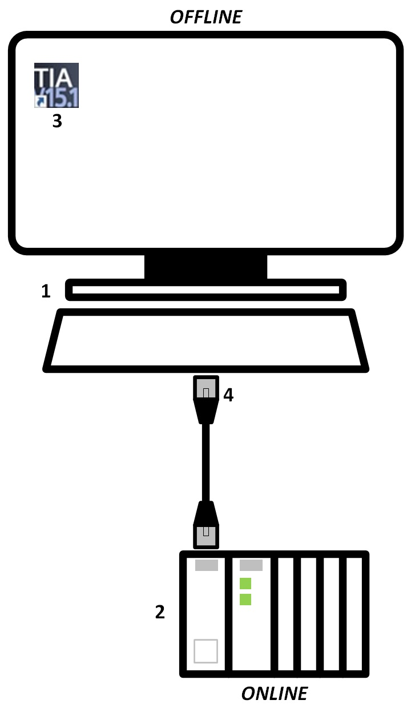

# Study materials
_____________________________________
## Literature
* Addendum 2: TAG naming convention
* Addendum 3: Siemens TIA Portal

## Equipment

>   **1** Engineering station  
>   **2** SIMATIC S7-1200 controller, e.g. CPU 1215C DC/DC/RLY – firmware V4.2 or higher  
>   **3** SIMATIC STEP 7 software in TIA Portal – V15 SP1 or higher  
>   **4** Ethernet connection between engineering station and controller

