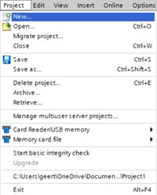
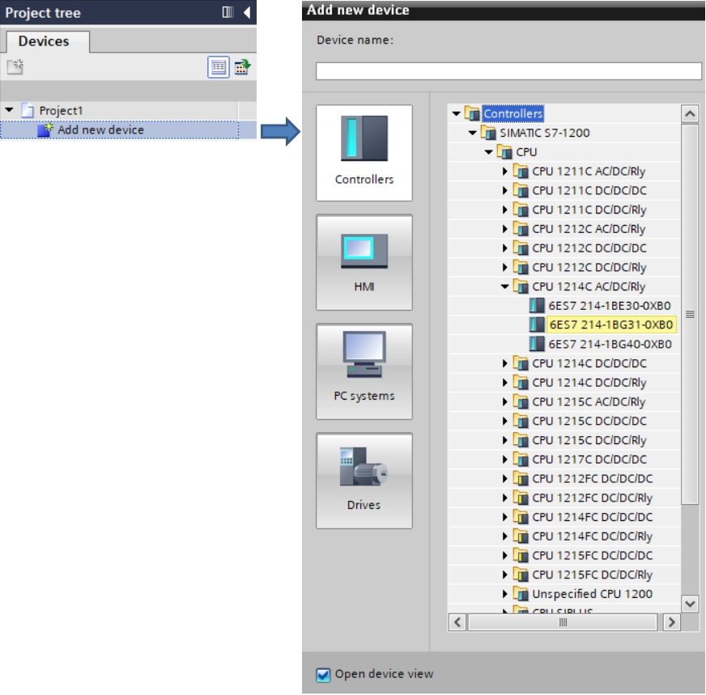
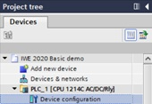
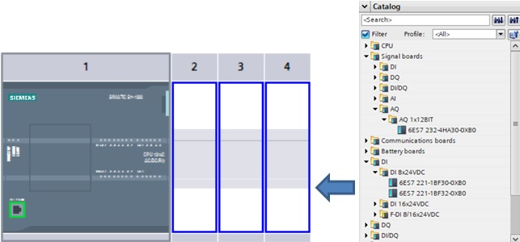
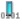

# Introduction into Siemens TIA Portal
_____________________________________
## First steps

## Create a new Project

## PLC Hardware
### Add a new PLC Device

Configure the device by double-click on “Device configuration” and selecting the CPU in the Device view. The properties can be configured in the Properties view.

### Add modules to a Device
Add the signal board and the signal module with drag-and-drop from the hardware catalog to the device. Allowed locations in the rack are showed with a blue rectangle.

### Download hardware

## PLC software
Software code can be programmed into 'Program blocks' in 5 programming languages:
* Function Block Diagram (FBD)
* Ladder (LAD)
* Sequential Function Chart (SFC)
* Structured Text (ST)
* Structured Control language (SCL)

FBD, LAD and SFC are graphical based programming languages. This means that instructions are figures which can be connected. Each

### Organization blocks [OB]

### Functions [FC]

### Function Blocks [FB]

### Data Blocks [FB]

## PLC TAGs
BOOL, BYTE, WORD, DWORD & LWORD

## Download software

## Debugging
### Hardware
| **Icon** | **Description**   |
|:--------:|:------------------|
|  | No error          |
| | Maintenance needed |
|  | Maintenance necessary |
|  | Error, maintenance necessary |
|  | The device or module is deactivated |
|  | The device or module cannot be reached |
|  | No input and/or output data available |
|  | There is no diagnostic data available because the online and offline configurations are different |
|  | The device or module is available but is not compatible |
|  | There is a connection with the device or module but state is unknown |
|  | There is a connection with the device or module but diagnostic is not allowed |
|  | Hardware fault, **can be showed in combination with other icons** |

## Software
| **Icon** | **Description**                                                   |
|:---------:|-------------------------------------------------------------------|
| | Software error, **can be showed in combination with other icons** |
|  | There is a difference between the online and offline block        |
|  | Block only exist in the online version                            |
|  | Block only exist in the offline version                           |
|  | The offline and online blocks are equal                           |

## Backup
It is possible to create a backup of your project by archiving it. An **archive** is a TIA Portal ZIP file a can only be opened by retrieving the file.

| **File type** | **Description**                                                    |
|---------------|--------------------------------------------------------------------|
| .ZAP15_1      | TIA Portal ZIP archive of a V15.1 project                          |
| .ZAL15_1      | TIA Portal ZIP archive of a V15.1 library                          |
| .AP15_1       | TIA Portal project V15.1 (1) |
| .AL15_1       | TIA Portal library V15.1 (1) |

(1) *!! Cannot be used as standalone file !!*
