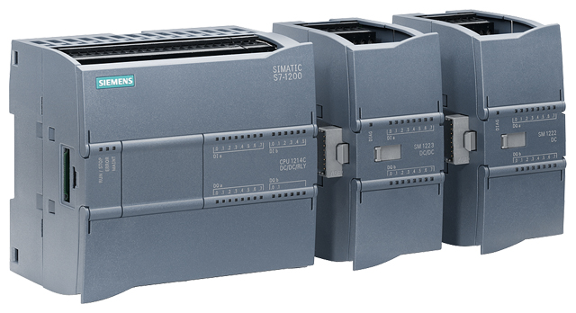

_____________________________________
## Siemens TIA Portal
With SIMATIC TIA Portal users configure, program, test and diagnose basic, advanced, distributed controllers and HMI panels, whether it is PLC- or PC-based, incl. software controllers. SIMATIC TIA Portal can be expand with supplements for configure, test and diagnose applications such as drives, network applications, ... .

SIMATIC TIA Portal is one of the core products of the TIA Portal engineering framework seamlessly integrated into one platform by using shared services as well as data.

## Siemens TIA Portal licensing
| **TIA Portal Basic** | **TIA Portal Professional** | **TIA Portal Options** |
|:--------------------:|:---------------------------:|:----------------------:|
|  |  |  |
| The subset of TIA Portal controller software for the basic controller S7-1200 | The comprehensive software solution for programming the controllers S7-1200, S7-1500, S7-300 and S7-400 with a fixed number of integrated functions | Functional supplements to the standard controller software, e.g. for failsafe applications or technological tasks |
| **Basic license** | **Professional license** | **Optional licenses**  |

Educational institutes benefit from special conditions such as **educational licenses** which are Professional licenses limited in time (356-days).

## TIA Portal versions
The TIA Portal platform is constantly evolving, resulting in different versions over the years. Upward compatibility from older versions is only possible according to the schedule below.

Downward compatibility is not supported.

## TIA Portal icons
TIA Portal can be started by double-clicking the TIA Portal icon. A new set of icons come with the installation of TIA Portal.

| **Icon** | **Description**   |
|:--------:|:------------------|
|   | To start TIA Portal V15.1 |
|   | To start the TIA Portal updater for installing updates |
|   | To open the license manager |
|  | To start the PLC simulator for S7-1200 & S7-1500 CPU’s |
|  | A TIA Portal file |
|  | To open the PC communication settings necessary for HMI simulation with a CPU where administration rights are necessary1 |

 1 Can be started from: "C:\Program Files\Common Files\Siemens\CommunicationSettings\CommunicationSettings.exe" 

## Start TIA Portal
TIA Portal can be started, by double-clicking its icon, in 2 views:
- Portal view : Run through a wizard to add a device (**Default view**)
- Project view : To program and add devices (**Preferred view**)

The portal view provides a task-oriented view of the tools for working on the
project. Here, you can quickly decide what you want to do and open the tool for the task at hand. If necessary, a change to the project view takes place
automatically for the selected task.

The project view is used for hardware configuration, programming, creation of the visualization and many other tasks.

By default, the project view displays the menu bar with the toolbars at the top, the project tree with all components of a project on the left and the so-called task cards with instructions and libraries, for example, on the right.

If an element (for example, the device configuration) is selected in the project tree, it is displayed in the center and can be worked on there.

It is possible to switch between the 2 views by means of clicking the text "Project view" or "Portal view" at the bottom left.

## Create a new Project in TIA Portal
A new project can be created in Portal or Project view.

Portal view  |  Project view
:--:|:--:
"Create new Project"  |  "Project" > "New..."
 | 

## Add a new PLC Device to a project
### Portal view
The project will be created after pushing the "Create" button and opened. The menu "Start", "First steps" will open automatically.

Push "Configure a device" in "Start" > "First steps" and switch to the "Add new device" menu.

Select the S7-1200 CPU for your project and click on "Add".

### Project view
Double click on "Add new device" and select the S7-1200 CPU for your project.

Configure the device by double-click on “Device configuration” and selecting the CPU in the Device view. The properties can be configured in the Properties view.

## Add modules to a PLC Device
A PLC Device can be expanded with additional modules such as:
* Digital input modules to process digital sensors
* Digital output modules to control digital actuators
* Analog input modules to process analog sensors
* Analog output modules to control analog actuators
* Industrial network modules to process communication through Profibus, ProfiNET, etc.
* Other modules such as ..

The Siemens S7-1200 CPU is foreseen with an extra location for modules in the middle of the CPU. Additional modules for this location are called boards.

Modules and boards can be added to a PLC device by opening the "Device configuration" and to drag a module from the catalog to the CPU.
Allowed locations in the PLC rack are showed with a blue rectangle.

Each module and device can be configured in the "Properties" window of the "Device configuration" by selecting the item. Also some internal parts of a device can be configured this way.

For example: The ProfiNET/Ethernet port can be configured in the "Properties" window after selecting it.

Remark: Create a subnet if the CPU is not networked.

### Download hardware
Each change in the "Device configuration" must be transferred to the CPU. This is done by downloading the hardware.

Before you download the configuration, you should save your project by clicking the  button. The next step is to compile your CPU with the device configuration, first select the "CPU_1215C [CPU1215C DC/DC/DC]" folder and click the  "Compile" icon.

> **Note:**
> "Save project" should be used repeatedly when working on a project since this does not happen automatically. A prompt to save the project only occurs when the TIA Portal is closed.

If the project was compiled without errors, you see the following screen.

To download your entire CPU, select the → "CPU_1215C [CPU1215C DC/DC/DC]" folder and click the  "Download to device" button.

The manager for configuring the connection properties (extended download) opens.

First, the interface must be correctly selected. This happens in three steps.
> **Step 1**: Type of the PG/PC interface → PN/IE
>   
> **Step 2**: PG/PC interface  → Select your network card
>   
> **Step 3**: Connection to interface/subnet → "PN/IE_1"
>   

## PLC software
Software code can be programmed into 'Program blocks' in 5 programming languages:
* Function Block Diagram (FBD)
* Ladder (LAD)
* Sequential Function Chart (SFC)
* Structured Text (ST)
* Structured Control language (SCL)

FBD, LAD and SFC are graphical based programming languages. This means that instructions are figures which can be connected. Each

### Organization blocks [OB]

### Functions [FC]

### Function Blocks [FB]

### Data Blocks [FB]

## PLC TAGs
BOOL, BYTE, WORD, DWORD & LWORD

## Download software

## Debugging
### Hardware
| **Icon** | **Description**   |
|:--------:|:------------------|
|  | No error          |
| | Maintenance needed |
|  | Maintenance necessary |
|  | Error, maintenance necessary |
|  | The device or module is deactivated |
|  | The device or module cannot be reached |
|  | No input and/or output data available |
|  | There is no diagnostic data available because the online and offline configurations are different |
|  | The device or module is available but is not compatible |
|  | There is a connection with the device or module but state is unknown |
|  | There is a connection with the device or module but diagnostic is not allowed |
|  | Hardware fault, **can be showed in combination with other icons** |

## Software
| **Icon** | **Description**                                                   |
|:---------:|-------------------------------------------------------------------|
| | Software error, **can be showed in combination with other icons** |
|  | There is a difference between the online and offline block        |
|  | Block only exist in the online version                            |
|  | Block only exist in the offline version                           |
|  | The offline and online blocks are equal                           |

## Backup
It is possible to create a backup of your project by archiving it.
An **archive** is a TIA Portal ZIP file a can only be opened by retrieving the file.

| **File type** | **Description**                                                    |
|---------------|--------------------------------------------------------------------|
| .ZAP15_1      | TIA Portal ZIP archive of a V15.1 project                          |
| .ZAL15_1      | TIA Portal ZIP archive of a V15.1 library                          |
| .AP15_1       | TIA Portal project V15.1 (1) |
| .AL15_1       | TIA Portal library V15.1 (1) |

1 *!! Cannot be used as standalone file !!*
