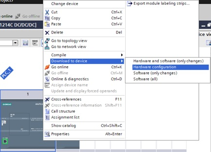

# Introduction into Siemens TIA Portal
_____________________________________
## About Siemens TIA Portal
With SIMATIC TIA Portal users configure, program, test and diagnose the basic, advanced, distributed controllers and HMI panels, whether it is PLC- or PC-based, incl. software controllers.
SIMATIC TIA Portal can be expand with supplements for configure, test and diagnose applications such as drives, network applications, ... .

SIMATIC TIA Portal is one of the core products of the TIA Portal engineering framework seamlessly integrated into one platform by using shared services as well as data.

## Siemens TIA Portal licensing
| **TIA Portal Basic** | **TIA Portal Professional** | **TIA Portal Options** |
|:--------------------:|:---------------------------:|:----------------------:|
|  |  |  |
| The subset of TIA Portal controller software for the basic controller S7-1200 | The comprehensive software solution for programming the controllers S7-1200, S7-1500, S7-300 and S7-400 with a fixed number of integrated functions | Functional supplements to the standard controller software, e.g. for failsafe applications or technological tasks |
| **Basic license** | **Professional license** | **Optional licenses**  |

Educational institutes benefit from special conditions such as **educational licenses** which are Professional licenses limited in time (356-days).

## TIA Portal versions
The TIA Portal platform is constantly evolving, resulting in different versions over the years. Upward compatibility from older versions is only possible according to the schedule below.

Downward compatibility is not supported.

## TIA Portal icons
TIA Portal can be started by double-clicking the TIA Portal icon. A new set of icons come with the installation of TIA Portal.

| **Icon** | **Description**   |
|:--------:|:------------------|
|   | To start TIA Portal V15.1 |
|   | To start the TIA Portal updater for installing updates |
|   | To open the license manager |
|  | To start the PLC simulator for S7-1200 & S7-1500 CPU’s |
|  | A TIA Portal file |
|  | To open the PC communication settings necessary for HMI simulation with a CPU where administration rights are necessary1 |

 1 Can be started from: "C:\Program Files\Common Files\Siemens\CommunicationSettings\CommunicationSettings.exe" 

## Start TIA Portal
Start TIA Portal by double-clicking the icon.

TIA Portal can be started in 2 views where it is possible to switch between views:
* Portal view : Run through a wizard to add a device (**Default view**)
* Project view : To program and add devices (**Preferred view**)

## Create a new Project

## PLC Hardware
### Add a new PLC Device

Configure the device by double-click on “Device configuration” and selecting the CPU in the Device view. The properties can be configured in the Properties view.

### Add modules to a Device
Add the signal board and the signal module with drag-and-drop from the hardware catalog to the device. Allowed locations in the rack are showed with a blue rectangle.

### Download hardware

## PLC software
Software code can be programmed into 'Program blocks' in 5 programming languages:
* Function Block Diagram (FBD)
* Ladder (LAD)
* Sequential Function Chart (SFC)
* Structured Text (ST)
* Structured Control language (SCL)

FBD, LAD and SFC are graphical based programming languages. This means that instructions are figures which can be connected. Each

### Organization blocks [OB]

### Functions [FC]

### Function Blocks [FB]

  
Click to expand!

  tested

### Data Blocks [FB]

## PLC TAGs
BOOL, BYTE, WORD, DWORD & LWORD

## Download software

## Debugging
### Hardware
| **Icon** | **Description**   |
|:--------:|:------------------|
|  | No error          |
| | Maintenance needed |
|  | Maintenance necessary |
|  | Error, maintenance necessary |
|  | The device or module is deactivated |
|  | The device or module cannot be reached |
|  | No input and/or output data available |
|  | There is no diagnostic data available because the online and offline configurations are different |
|  | The device or module is available but is not compatible |
|  | There is a connection with the device or module but state is unknown |
|  | There is a connection with the device or module but diagnostic is not allowed |
|  | Hardware fault, **can be showed in combination with other icons** |

## Software
| **Icon** | **Description**                                                   |
|:---------:|-------------------------------------------------------------------|
| | Software error, **can be showed in combination with other icons** |
|  | There is a difference between the online and offline block        |
|  | Block only exist in the online version                            |
|  | Block only exist in the offline version                           |
|  | The offline and online blocks are equal                           |

## Backup
It is possible to create a backup of your project by archiving it.
An **archive** is a TIA Portal ZIP file a can only be opened by retrieving the file.

| **File type** | **Description**                                                    |
|---------------|--------------------------------------------------------------------|
| .ZAP15_1      | TIA Portal ZIP archive of a V15.1 project                          |
| .ZAL15_1      | TIA Portal ZIP archive of a V15.1 library                          |
| .AP15_1       | TIA Portal project V15.1 (1) |
| .AL15_1       | TIA Portal library V15.1 (1) |

1 *!! Cannot be used as standalone file !!*
