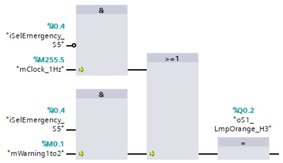
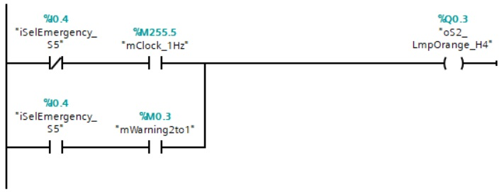

# The railroad bridge project
_____________________________________
## Overview
-   The [first goal](Ex02/Subchapter04_01.md) is to configure and to download the hardware of a PLC device
-   The [second goal](Ex02/Subchapter04_02.md) is to debug hardware errors
-   The [third goal](Ex02/Subchapter04_03.md) is to create and to download basic software, according IEC 61131-3
-   The [fourth goal](Ex02/Subchapter04_04.md) is to debug software errors and programming faults
-   The [last goal](Ex02/Subchapter04_05.md) is to deliver a working project

Back to the [project scope](Ex02/Subchapter04.md).

## Goal 3 : Create software
**Step 1 :** Create next TAG tables:

```javascript
Table_IO
Table_Flags
```

**Step 2 :** **Create** the next **PLC TAGs** into the new PLC TAG tables:

| **Name**           | **Datatype** | **Address** | **Comment**                     |
|--------------------|--------------|-------------|---------------------------------|
| *Table_IO*         |              |             |                                 |
| iSelEmergency_S5   | BOOL         | %I 0.x<sup>1</sup>  | Switch emergency operation      |
| oS1_LmpGreen_H1    | BOOL         | %Q 0.0      | Sign 1 – Green light            |
| oS2_LmpGreen_H2    | BOOL         | %Q 0.1      | Sign 2 – Green light            |
| oS1_LmpOrange_H3   | BOOL         | %Q 0.2      | Sign 1 – Orange light           |
| oS2_LmpOrange_H4   | BOOL         | %Q 0.3      | Sign 2 – Orange light           |
| oS1_LmpRed_H5      | BOOL         | %Q 0.4      | Sign 1 – Red light              |
| oS2_LmpRed_H6      | BOOL         | %Q 0.5      | Sign 2 – Red light              |
| oRelFreezeError    | BOOL         | %Q 1.0       | Freeze error relay              |
| *Table_Flags*      |              |             |                                 |
| mFrom1to2          | BOOL         | %M 0.0      | Traffic from sign 1 to 2        |
| mWarning1to2       | BOOL         | %M 0.1      | Warning traffic on sign 1       |
| mFrom2to1          | BOOL         | %M 0.2      | Traffic from sign 2 to 1        |
| mWarning2to1       | BOOL         | %M 0.3      | Warning traffic on sign 2       |
| mNormalByte        | BYTE         | %MB0        | Normal functionality byte       |
| mPrevNormalByte    | BYTE         | %MB1        | Previous status of mNormalByte  |
| mpfSelEmergency_S5 | BOOL         | %M 2.0      | Rising edge of iSelEmergency-S5 |

<sup>1</sup> *Select an input with a switch*

**Step 3 :** Activate the “*Offline view*” and start the programmation of FC_Sign1 by opening the function and add the next networks:

```javascript
Network 1 : Red lamp – STOP
Network 2 : Orange lamp – WARNING
Network 3 : Green lamp – DRIVE THROUGH
```

**Step 4 :** Change the title of the function to “Sign 1”

**Step 5 :** Program in network 2 the functionality of the orange lamp “oS1_LmpOrange_H3”.

```javascript
oS1_LmpOrange_H3:=(NOT(iSelEmergency_S5).mClock_1Hz)+(iSelEmergency_S5.mWarning1to2)
```

<details>
  <summary>Click here to view the solution</summary>

  

</details>
<br>

**Step 6 :** Select network 2 and copy this network to FC_Sign2. Replace after copying:

```javascript
mWarning1to2 *by* mWarning2to1
oS1_LmpOrange_H3 *by* oS2_LmpOrange_H4
```

**Step 7 :** Finish FC_Sign2 by adding networks, network titles and
a block title in the same structure as FC_Sign1.

**Step 8 :** Change the programming language of FC_Sign2 to LAD

<details>
  <summary>Click here to view the solution</summary>

  

</details>
<br>

**Step 9 :** Create a new function FC_Normal (do *__not__* call this function in %OB1)
