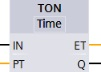
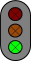
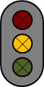
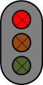

# The railroad bridge project
_____________________________________
## Overview
-   The [first goal](Ex02/Subchapter04_01.md) is to configure and to download the hardware of a PLC device
-   The [second goal](Ex02/Subchapter04_02.md) is to debug hardware errors
-   The [third goal](Ex02/Subchapter04_03.md) is to create and to download basic software, according IEC 61131-3
-   The [fourth goal](Ex02/Subchapter04_04.md) is to debug software errors and programming faults
-   The [last goal](Ex02/Subchapter04_05.md) is to deliver a working project

Back to the [project scope](Ex02/Subchapter04.md).

## Goal 5 : Deliver a working project
**Program** the functionality of the traffic lights in
>- FC_Normal - The automatic functionality of the signs
>- FC_Sign1 - Traffic lights of Sign 1 in FBD
>- FC_Sign2 - Traffic lights of Sign 2 in LAD

Use only the next instructions:
|  |  | |  |
| :---: | :---: | :---: | :---: |

Scheme to program FC_Normal:
| **FC_Normal** | **Network 1 Actions** | **Network 2 Actions** | **Network 3 Actions** | **Network 4 Actions** | **Condition**      |
| :-----------: | :-------------------: | :-------------------: | :-------------------: | :-------------------: | :----------------: |
| Step 1        | **mFrom1to2:=TRUE**   mWarning1to2:=FALSE   mFrom2to1:=FALSE   mWarning2to1:=FALSE |  |  |  | iSelEmergency_S5  OFF->ON |
| Step 2        | **mFrom1to2:=TRUE**   mWarning1to2:=FALSE   mFrom2to1:=FALSE   mWarning2to1:=FALSE |  |  |  | TON1.PT=12s  -> Step 3 |
| Step 3        |  | mFrom1to2:=FALSE   **mWarning1to2:=TRUE**   mFrom2to1:=FALSE   mWarning2to1:=FALSE |  |  | TON2.PT=3s  -> Step 4  |
| Step 4        |  |  | mFrom1to2:=FALSE   mWarning1to2:=FALSE   **mFrom2to1:=TRUE**   mWarning2to1:=FALSE |  | TON3.PT=12s  -> Step 5 |
| Step 5        |  |  |  | mFrom1to2:=FALSE   mWarning1to2:=FALSE   mFrom2to1:=FALSE   **mWarning2to1:=TRUE** | TON4.PT=3s  -> Step 2  |

Scheme to program FC_Sign1 & FC_Sign2:
|               | **mFrom1to2**      | **mWarning1to2**                              | **mFrom2to1**   | **mWarning2to1**   |
| :-----------: | :----------------: | :-------------------------------------------: | :-------------: | :----------------: |
| **iSelEmergency_S5=OFF** | T = 12 s         | T = 3 s                                      | T = 12 s      | T = 3 s          |
| Sign 1        |  |  |  |  |
| Sign 2        |  |  |  |  |
| **iSelEmergency_S5=ON**  | **Traffic sign** | **Description**                              |               |                  |
| Sign 1        |  | Orange light blinks with a frequency of 1 Hz |               |                  |
| Sign 2        |  | Orange light blinks with a frequency of 1 Hz |               |                  |

**Download** the software to the device **and test** the functionality of traffic sign 1 and traffic sign 2.
