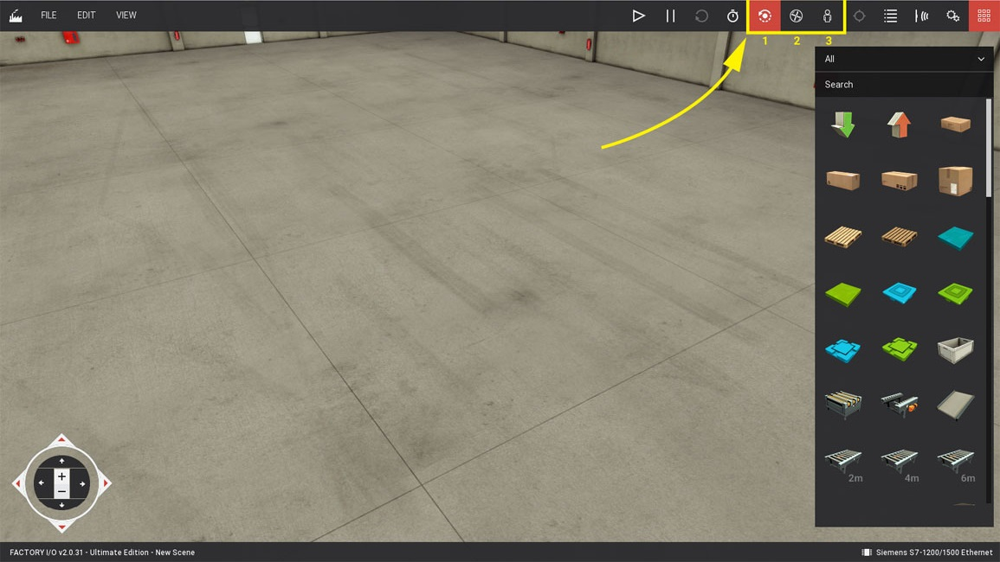

_____________________________________
# Getting started with Real Games Factory IO
This document is based on the Real Games Factory IO online manual
- Getting started - https://docs.factoryio.com/getting-started/

## Main view
One of the most important skills to learn in Factory I/O is how to use cameras. Cameras are used to navigate in the 3D space and are the key to interacting with parts or building new scenes. You can use three types of cameras: **Orbit (1), Fly (2)** and **First Person (3)**.

Get used to each type by testing the actions as described below. Keep in mind that each camera was designed for a specific functional purpose.

## Orbit camera
The Orbit camera is the default camera and should be used when building a scene. This is the only camera that allows you to move through parts without colliding with them.

It works by rotating around a point of interest (indicated by a white dot) which you define by Double Left-clicking on a part. Once the point of interest is defined, you rotate the camera around it by holding the Right Mouse Button (RMB) and dragging the mouse. New parts dragged from the Palette are created at the height defined by this point, except for parts which are typically placed on the floor, such as conveyors, stations, etc.

<video width="598" height="350" autoplay="" muted="" loop="">
  <source src="../Ex03/Images/orbit_camera.mp4" type="video/mp4">
</video>

| Control | Action |
| :---:   | :---:  |
| Double LMB | 	Sets the camera point of interest. The camera will rotate around this point, and new parts will be created at this height.|
| RMB + Drag | 	Rotates the camera around the point of interest. |
| MMB + Drag | 	Translates the camera horizontally. |
| Mouse Wheel | 	Zooms the camera in and out. |
| Backspace | 	Resets the camera to the default position and rotation. |

## Fly camera
The Fly camera is used to move freely in the 3D space. This camera collides with scene parts but is not detected by sensors.

<video width="598" height="350" autoplay="" muted="" loop="">
  <source src="../Ex03/Images/fly_camera.mp4" type="video/mp4">
</video>

| Control | Action |
| :---:   | :---:  |
| Double LMB |	Looks the camera to where the mouse cursor is pointing. |
| RMB + Drag |	Rotates the camera. |
| Mouse Wheel |	Translates the camera vertically. |
| LMB + RMB |	Moves the camera forward. |
| W - Up |	Moves the camera forward. |
| S - Down |	Moves the camera backward. |
| A - Left |	Moves the camera left. |
| D - Right |	Moves the camera right. |

## First person camera
The First Person camera represents a person of 1.8m (~5.9 feet) height. It should be used when simulating a person in a virtual factory. It collides with scene parts and, by default, is not detected by sensors.

<video width="598" height="350" autoplay="" muted="" loop="">
  <source src="../Ex03/Images/first_person_camera.mp4" type="video/mp4">
</video>

| Control | Action |
| :---:   | :---:  |
| Double LMB |	Looks the camera to where the mouse cursor is pointing. |
| RMB + Drag |Rotates the camera. |
| LMB + RMB |	Moves forward. |
| W |	Moves forward. |
| S |	Moves backward.
| A |	Strafes left. |
| D |	Strafes right. |
| Space |	Jumps. |

# Opening a scene
To open a scene choose **Open** from the **File Menu (Ctrl + O)** and select it from the list by **Left-clicking**.

Factory I/O comes with 21 Scenes, which can be accessed under the **Scenes** tab. You may also use any of these scenes as a starting point for a new one by opening and saving it with a custom name.

# Manually controlling a scene
Before controlling a scene with an external controller (a PLC, for instance) it's recommended to test it manually. This way you can ensure that the scene layout works as expected. But first, you need to learn what **Tags** are and how they can be used to control parts.

Any part that is a sensor or actuator has at least one tag. **Tags** are made of a name and a value and can be of two different types: **Sensors Tags** and **Actuators Tags**. They can hold three different data types: Boolean for on/off values, Float for analog values (real numbers) and Integer for specific data.

Tag values can be **Forced** at any moment, allowing you to play the role of the controller. To control your scene manually, you **force** the **Actuators Tags**, simulating a value coming from the controller.

Using the scene created on 3. Creating a Scene, try to transport the pallet to the left conveyor.
    1. Switch to Run mode by clicking the **Play** button **(1)**.
    2. Show the actuators tags by clicking on the **Actuators Tags** button **(2)**.
    3. **Left-click** on a tag to dock it. Once a tag is docked, you can force its value. You can **Dock All Tags** and **Clear Docked Tags** on the **View Menu**.

# Controlling with a PLC
Now that you have created your factory it's time to control it with a PLC. But first, you should learn what I/O Drivers are and how to use them.

An I/O Driver is a built-in feature of Factory I/O responsible for "talking" to an external controller. Factory I/O includes many I/O Drivers, each one for a specific technology. You select a driver in Factory I/O based on the controller you want to use. Next, you configure this driver, so it knows how to "talk" to the controller and how to read and write I/O from it.

As an example, this tutorial shows how to use a Siemens S7-1200 PLC. However, most of the steps described here apply to other drivers as well.

1. Open the Drivers window by clicking on **File** and next on **Drivers (F4)**. Alternatively, you may open the Drivers window by **Left-clicking** on the current driver displayed on the status bar.

2. Select Siemens **S7-1200/1500 Ethernet** driver from the list by **Left-clicking** on it.

3. Click the **Configuration** button to setup the driver according to your PLC model and IP address.

4. Choose S7-1200 model and fill in the **Host** field with your PLC's IP address. Proceed to the next step by clicking on the **Back Arrow** (or the **ESC** key).

5. Press the **Connect** button to connect to the PLC. A successful connection will be indicated by a green sign displayed next to the drivers list.

6. Start mapping tags by dragging and dropping each one onto the intended port. To remove a tag from a port just drag it back to the list. Once you have mapped all tags, set the simulation to Run Mode and test your PLC logic.

<video width="1035" height="585" autoplay="" muted="" loop="">
  <source src="../Ex03/Images/mapping_io_points.mp4" type="video/mp4">
</video>
