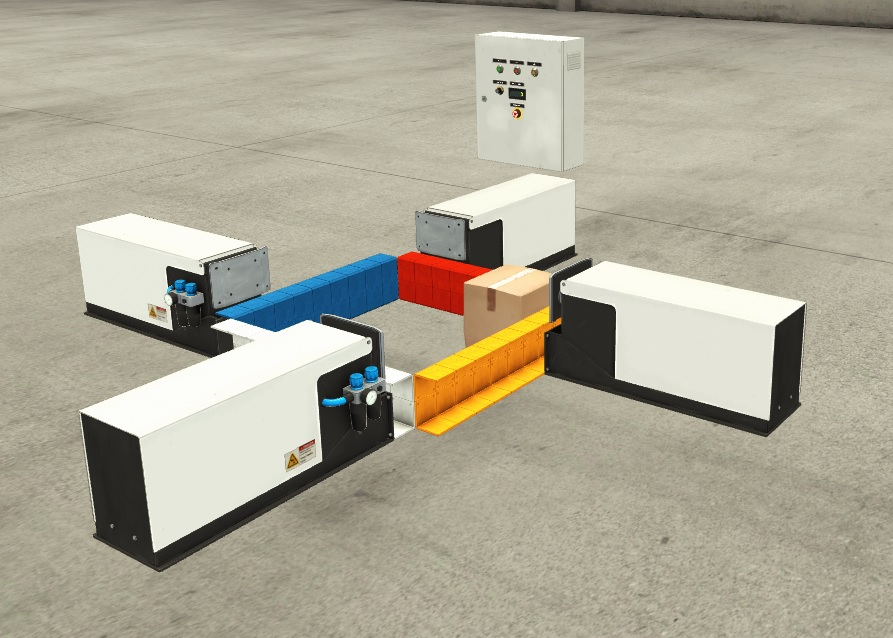

_____________________________________
## Overview
-   The [first goal](Ex03/Subchapter04_01.md) is to recognize the working principles
-   The [second goal](Ex03/Subchapter04_02.md) is to define the Factory IO & PLC Tags
-   The [third goal](Ex03/Subchapter04_03.md) is to create and to download the PLC hardware
-   The [fourth goal](Ex03/Subchapter04_04.md) is to create and to download the PLC software, according IEC 61131-3
-   The [last goal](Ex03/Subchapter04_05.md) is to deliver a working project

## Scope
Create a solution for the pusher game where a carton box is pushed around over and over until the game is stopped.

It is necessary to foreseen some advantages such as:
-  The speed of the game must be controllable by means of a turn knob
-  The number of "rounds" is showed on a display
-  The number of "rounds" must be reset to zero every time the game is started
-  The game may not count "rounds" if the speed is to high if at least one pusher is to slow
