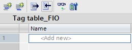
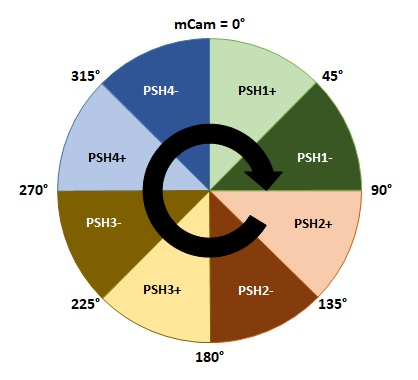

_____________________________________
# The Pusher Game
## Overview
-   The [first goal](Ex03/Subchapter04_01.md) is to recognize the working principles
-   The [second goal](Ex03/Subchapter04_02.md) is to define the Factory IO & PLC Tags
-   The [third goal](Ex03/Subchapter04_03.md) is to create and to download the PLC hardware
-   The [fourth goal](Ex03/Subchapter04_04.md) is to create and to download the PLC software, according IEC 61131-3
-   The [last goal](Ex03/Subchapter04_05.md) is to is to deliver a working project

Back to the [project scope](Ex03/Subchapter04.md).

## Goal 4 : Create PLC software

**Step 1 :** Create a new PLC tags table and rename it
```javascript
PLC Tags Table  : Tag table_FIO
```

**Step 2 :** Import the tags into Siemens TIA Portal. Do this by importing  the XML file that was downloaded by Factory IO to **This pc > My Documents > Factory IO**.



**Step 3 :** Rename, in Siemens TIA Portal, the Tags according the Tag naming convention.
```javascript
//Inputs
iPSH1_SenOut_S11        BOOL	%I0.0	Pusher 1 - Sensor pusher out
iPSH1_SenIn_S12         BOOL	%I0.1	Pusher 1 - Sensor pusher in
iPSH2_SenOut_S21        BOOL	%I0.2	Pusher 2 - Sensor pusher out
iPSH2_SenIn_S22         BOOL	%I0.3	Pusher 2 - Sensor pusher in
iPSH3_SenOut_S31        BOOL	%I0.4	Pusher 3 - Sensor pusher out
iPSH3_SenIn_S32         BOOL	%I0.5	Pusher 3 - Sensor pusher in
iPSH4_SenOut_S41        BOOL	%I0.6	Pusher 4 - Sensor pusher out
iPSH4_SenIn_S42         BOOL	%I0.7	Pusher 4 - Sensor pusher in
iCC_BtnStart_S1         BOOL	%I1.0	Button on control cabinet - Start
iCC_BtnStop_S2          BOOL	%I1.1	Button on control cabinet - Stop
iCC_BtnReset_S3         BOOL	%I1.2	Button on control cabinet - Reset
iFIO_BtnReset           BOOL	%I1.7	Reset scene from Factory IO
iPSH4_PV                REAL	%ID100	Pusher 4 - Process value
iCC_PotSpd_R1           REAL	%ID104	Pot. meter on control cabinet - Speed control

//Flags
mAL_PSH1Out     BOOL	%M10.0	Alarm - Pusher 1 sensor out (+)
mAL_PSH1In      BOOL	%M10.1	Alarm - Pusher 1 sensor in (-)
mAL_PSH2Out     BOOL	%M10.2	Alarm - Pusher 2 sensor out (+)
mAL_PSH2In      BOOL	%M10.3	Alarm - Pusher 2 sensor in (-)
mAL_PSH3Out     BOOL	%M10.4	Alarm - Pusher 3 sensor out (+)
mAL_PSH3In      BOOL	%M10.5	Alarm - Pusher 3 sensor in (-)
mAL_PSH4Out     BOOL	%M10.6	Alarm - Pusher 4 sensor out (+)
mAL_PSH4In      BOOL	%M10.7	Alarm - Pusher 4 sensor in (-)
mPoClock_5Hz    BOOL	%M254.5
mStarted        BOOL	%M8.0	Game started
mPoStarted      BOOL	%M8.1	Positive edge on game started
mCam            REAL	%MD0	Virtual cam
mCC_PotSpd      REAL	%MD6	Pot. meter speed as REAL
mRounds         INT	%MW4	Number of rounds

//Outputs
oPSH1_VlvOut_K11  BOOL	%Q0.0	Pusher 1 - Move pusher out
oPSH2_VlvOut_K21  BOOL	%Q0.1	Pusher 2 - Move pusher out
oPSH3_VlvOut_K31  BOOL	%Q0.2	Pusher 3 - Move pusher out
oPSH3_VlvIn_K32   BOOL	%Q0.3	Pusher 3 - Move pusher in
oCC_LmpStart_H1   BOOL	%Q1.0	Lamp on control cabinet - Start
oCC_LampErr_H2    BOOL	%Q1.1	Lamp on control cabinet - Error
oPSH4_SP          REAL	%QD100	Pusher 4 - Setpoint
oCC_DisRounds     DINT	%QD104	Display on control cabinet - Number of rounds
```

**Step 4 :** Program in FC_CamController the functionallity of "mCam" in SCL. mCam is a virtual wheel that turns around from 0° to 360° when the game is started.

```javascript
IF mCam < 0.0 OR mCam > 360 THEN mCam := 0.0
IF ↑mStarted THEN mCam := 0.0, mRounds := 0
IF ↑Clock_10H and mStarted THEN mCam := mCam + iCC_PotSpd_R1
IF ↑(mCam >= 360.0) THEN mRounds := mRounds + 1

(Remark: ↑ = Rising edge)
```



**Step 5 :** Program in FC_CC the start-stop of the game in FBD with a SR-FlipFlop.
```javascript
Network 1 : Start-stop circuit "mStarted" and the start lamp "oCC_LmpStart_H1"
Start circuit = Start button
Stop circuit = NOT Stop button
```

**Step 6 :** Program in the corresponding function [FC_PusherX] the working principles of the pushers in FBD.
```javascript
FC_Pusher1+ : mStarted AND 0.0°< mCam < 45.0° => oPSH1_VlvOut_K11
FC_Pusher2+ : mStarted AND 90.0°< mCam < 135.0° => oPSH2_VlvOut_K21
FC_Pusher3+ : mStarted AND 180.0°< mCam < 225.0° => oPSH3_VlvOut_K31
FC_Pusher3- : mStarted AND 225.0°< mCam < 270.0° => oPSH3_VlvIn_K32
FC_Pusher4+ : mStarted AND 270.0°< mCam < 315.0° => oPSH4_SP := iCC_PotSpd_R1
FC_Pusher4- : mStarted AND 315.0°< mCam < 360.0° => oPSH4_SP := iCC_PotSpd_R1 * (-1.0)

TIP : Use FBD comperator instructions
```
