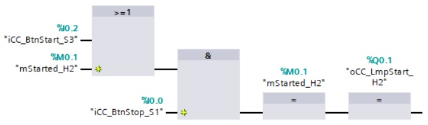

# Start-stop control circuit
_____________________________________
A start-stop control cirucit is used to start and stop actuators. At least one start pushbutton and one stop pushbutton is integrated into the circuit to controle the output result.

## Characteristics
- A **start pushbutton** is foreseen with a **normally open** electrical contact
- A **stop pushbutton** is foreseen with a **normally closed** electrical contact
- Pushing on the start button will set the output result to TRUE
- The output result remains TRUE when the start button [iCC_BtnStart_S3] is released
- The output result [mGenStarted] becomes FALSE when the stop button is pressed or when there is a wire-break in the electrical circuit of the stop button
- The stopping has priority over starting. The output result will be FALSE When the start and the stop buttons are pressed at the same time.

## Start-stop ciruits and the Machine Directive 2006/42/EG, 2006
### Starting
It must be possible to start machinery only by voluntary actuation of a control device provided for the purpose.

The same requirement applies:
- When restarting the machinery after a stoppage, whatever the cause,
- when effecting a significant change in the operating conditions.

However, the restarting of the machinery or a change in operating conditions may be effected by voluntary actuation of a device other than the control device provided for the purpose, on condition that this does not lead to a hazardous situation.

For machinery functioning in automatic mode, the starting of the machinery, restarting after a stoppage, or a change in operating conditions may be possible without intervention, provided this does not lead to a hazardous situation.

Where machinery has several starting control devices and the operators can therefore put each other in danger, additional devices must be fitted to rule out such risks. If safety requires that starting and/or stopping must be performed in a specific sequence, there must be devices which ensure that these operations are performed in the correct order.

### Stopping
Machinery must be fitted with a control device whereby the machinery can be brought safely to a complete stop.

Each workstation must be fitted with a control device to stop some or all of the functions of the machinery, depending on the existing hazards, so that the machinery is rendered safe.

The machinery's stop control must have priority over the start controls.

Once the machinery or its hazardous functions have stopped, the energy supply to the actuators concerned must be cut off.

Where, for operational reasons, a stop control that does not cut off the energy supply to the actuators is required, the stop condition must be monitored and maintained.

## Programming methods
A start-stop control circuit can be programmed on 2 different ways:
- With a FlipFlop
- With a Latch

```javascript
Used Tags in this chapter:
- iCC_BtnStop_S1 - BOOL - %I 0.0 - Red stop pushbutton
- iCC_BtnStart_S3 - BOOL - %I 0.2 - Green start pushbutton
- mStarted_H1 - BOOL - %M 0.0 - Installation 1 started
- mStarted_H2 - BOOL - %M 0.1 - Installation 2 started
- oCC_LmpStart_H1 - BOOL - %Q 0.0 - Green lamp installation 1 started
- oCC_LmpStart_H2 - BOOL - %Q 0.1 - Green lamp installation 2 started
```

### FlipFlop method


### Latch method


## Goal : Programming & testing start-stop control circuits
**Step 1 :** Create a new TIA Portal project
```javascript
Project name  : Ex4-ControlCircuits
Author        : Your name
Comment       : Control Circuits
```

**Step 2 :** Add a PLC-device with next CPU settings
```javascript
Type                          : See available CPU
System byte                   : %MB254
Clock memory byte             : %MB255
Digital input start address   : %IB0
Output start address          : %QB0
Analog input start address    : %IB64
Analog output start address   : %QB80
IP-address                    : 192.168.0.30
IP-address subnet mask        : 255.255.255.0
```

**Step 3 :** Add next *Functions* (FC) into PLC_1 in the LAD program language:
```javascript
FC_StartStop
FC_Alarm
FC_Teleruptor
```

**Step 4 :** Create the next networks in FC_Startstop
```javascript
Network 1 : Start-stop circuit (FlipFlop)
Network 2 : Start-stop circuit (Latch)
```
**Step 5 :** Program both methods in FC_Startstop

**Step 6 :** Download the hardware & software and test the characteristics
