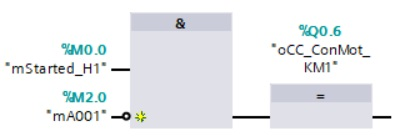

_____________________________________
# Alarm control circuit
An **alarm** respresent an abnormal condition or a fault in the automated system and has 2 conditions:
- FALSE = There is no abnormal situation, the alarm is deactivated
- TRUE = There is an abnormal situation, the alarm is activated

Common alarms:
- Emergency stop pressed
- Safety relay not activated
- Motor circuit breaker deactivated
- Analog sensor failure
- Level in tank to high
- Pressure in tank to high
- Compressed air failure
- etc.

## Characteristics
- An **alarm cause** is foreseen which can be a **normally open** or a **normally closed** electrical contact or it can be a comparisation. The result of the alarm cause is TRUE when there is an abnormal situation
- A **reset pushbutton** is foreseen with a **normally open** electrical contact
- The alarm is activated, becomes TRUE, when the alarm cause detects an abnormal situation
- The alarm remains actif even if the alarm cause disappears
- The alarm is deactivated on the moment that the reset pushbutton is pressed
- The alarm cause has priority over the reset. The alarm will be TRUE when the alarm cause detects an abnormal situation and the reset button is pressed.

## Alarm ciruits and the Machine Directive 2006/42/EG, 2006
The interruption, the re-establishment after an interruption or the fluctuation in whatever manner of the power supply to the machinery must not lead to dangerous situations.

Particular attention must be given to the following points:
- The machinery must not start unexpectedly,
- the parameters of the machinery must not change in an uncontrolled way when such change can lead to hazardous situations,
- the machinery must not be prevented from stopping if the command has already been given,
- no moving part of the machinery or piece held by the machinery must fall or be ejected,
- automatic or manual stopping of the moving parts, whatever they may be, must be unimpeded,
- the protective devices must remain fully effective or give a stop command.

## Programming
An alarm control circuit is programmed with a FlipFlop.

It is advisable to use unique alarmnumbers because it allows to create an alarmlog in a well-organized way.

```javascript
Used Tags in this chapter:
- iCC_BtnReset_S5 - BOOL - %I 0.5 - Reset pushbutton
- iCC_MbcMot_QM1 - BOOL - %I 1.1 - Motor circuit breaker feedback signal
- mA001 - BOOL - %M 2.0 - Circuit breaker failure motor 1 [-M1]
- mStarted_H1 - BOOL - %M 0.0 - Installation 1 started
- oCC_ConMot_KM1 - BOOL - %Q 0.6 - Motor contactor [-M1]
```


**Remark**: You can add a alarm into a start-stop control circuit. In this way you can automatically stop an automation system when there is an abnormal situation.

## Goal : Programming & testing an alarm control circuit
**Step 1 :** Cutt-off the power of the PLC Board

**Step 2 :** The following electrical digital input connections, the ones noted with a green star should be done.

**For safety reasons, electrical connections must be made with safety leads while the power is switched off! Students are not allowed to switch on the power!**


**Step 3 :** The following electrical digital output connections, the ones noted with a green star should be done.


**Step 4 :** Let the electrical circuits checked by a teacher. **Only the teacher shall switch on the power!**

**Step 5 :** Create the next networks in FC_Startstop
```javascript
Network 1 : Motor circuit breaker failure
Network 2 : To start and stop a motor
```
**Step 6 :** Program the alarm and the start-stop of a motor. The start-stop circuit is already programmed in the previous chapter where you use mStarted_H1. Do not forget to add the alarm so motor stops in case of an abnormal situation!



**Step 6 :** Download the software and test the characteristics
