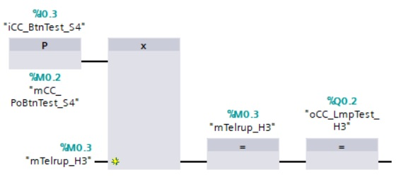
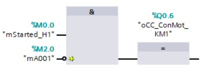

_____________________________________
# Teleruptor control circuit
With a **teleruptor** control circuit, it is possible to switch a light point on and off by means of an impulse. To achieve this, a spring-loaded switch or a push button is used.
- A single press on the button will activate the light point
- A new single press on the button will deactivate the light point

## Characteristics
- The use of an XOR instruction (only in FBD) in combination with a rising edge of the push button
- The output result is fed back to the XOR instruction.

## Programming
An teleruptor control circuit is programmed with a XOR instruction.

```javascript
Used Tags in this chapter:
- iCC_BtnTest_S4 - BOOL - %I 0.3 - Teleruptor test push button
- mCC_PoBtnTest_S4 - BOOL - %M 0.2 - Rising edge on iCC1_BtnTest_S4
- mTelrup_H3 - BOOL - %M 0.3 - Teleruptor H3
- oCC_LmpTest_H3 - BOOL - %Q 0.2 - Yellow lamp - Teleruptor test
```



## Goal : Programming & testing a teleruptor control circuit
**Step 1 :** Create the next network in FC_Teleruptor
```javascript
Network 1 : Test light point H3
```

**Step 2 :** Program the teleruptor control circuit into network 1 of FC_Teleruptor. Use just one push button to control one light point.



**Step 3 :** Download the software and test the characteristics.

<details>
	<summary>Click here to download the TIA Portal Exercise project solution</summary><!-- Empty line after this one needed, do not delete! -->

<br>
Download file <a href="./Ex04/Documents/Ex4_ControlCircuits.zap15_1">here</a>.</p>

  </details><!-- Empty line after this one needed, do not delete! -->
