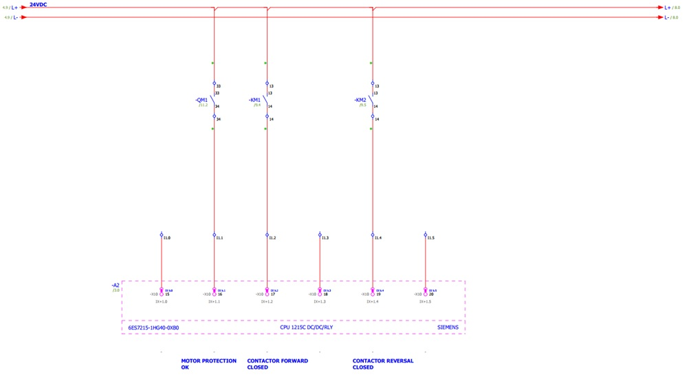
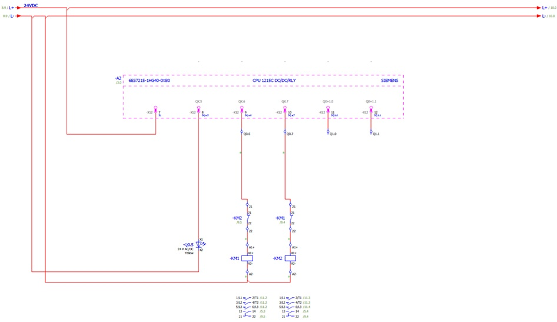
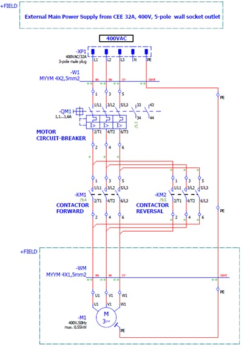

_____________________________________
# Basic motor software circuits
-   The [first goal](Ex05/Subchapter04_01.md) is to wire the electrical circuit for a direct online motor starter
-   The [second goal](Ex05/Subchapter04_02.md)  is to program and test PLC software for a direct online motor starter
- The [third goal](Ex05/Subchapter04_03.md) is to wire the electrical circuit for a direct reverse online motor starter
-   The [Last goal](Ex05/Subchapter04_04.md)  is to program and test PLC software for a direct reverse online motor starter

Back to the [project scope](Ex05/Subchapter04.md).

## Goal 3 : Wire the electrical circuit for a direct reverse online motor starter
**Step 1 :** The following electrical digital input connections, the ones noted with a green star should be done.

**For safety reasons, electrical connections must be made with safety leads while the power is switched off! Students are not allowed to switch on the power!**

**Step 2 :** The following electrical digital output connections, the ones noted with a green star should be done.

**Step 3 :** The following electrical digital power connections, the ones noted with a green star should be done.

**Step 4 :** Let the electrical circuits checked by a teacher. **Only the teacher shall switch on the power!**
