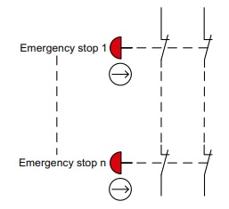
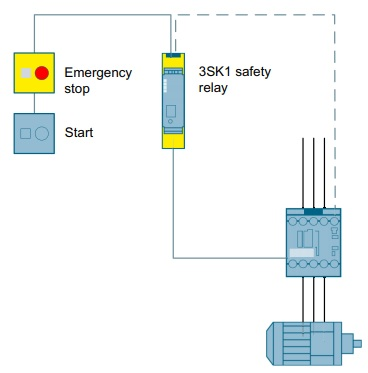
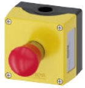
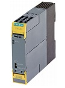
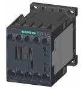

# Stopping in an emergency
_____________________________________
## General information
The emergency stop command device is a component that is widely used to protect people, equipment and the environment against possible hazards, and to initiate stopping in an emergency. This chapter describes applications with safety functions from precisely this application area.

**Typical application**
The emergency stop command device with its positive opening contact is monitored here using an evaluation unit.

If emergency stop is actuated, the evaluation unit switches the downstream actuators off via safe outputs in accordance with Stop Category 0 per EN 60204-1.

Before restarting or acknowledging the emergency stop switch-off by means of the start button, a check is made as to whether the contacts of the emergency stop command device have been closed and the actuators switched off.

**Unintentional actuation**
There is frequently a requirement to protect an emergency stop command device against unintentional actuation, and thus to enhance plant availability. The first step is to correctly position the emergency stop command device on the machine. The emergency stop command device must be easily accessible, free from obstruction and its actuation must not present a hazard.

There is also the option of using a protective collar to prevent unintentional actuation. Make sure here that unhindered accessibility is ensured.

**Conditions in series connection**
If multiple emergency stop command devices are electrically connected in series, each safety related shutdown via an emergency stop command device is a single supplementary safety function.

If identical emergency stop command devices are used, it is sufficient to regard one supplementary safety function as representing all supplementary safety functions.

## Emergency stop shutdown to SIL 1 or PL c with a 3SK1 safety relay
**Application**
Single-channel emergency stop shutdown of a motor by a 3SK1 safety relay and a power contactor.

**Design**

**Operating principle**
The 3SK1 safety relay monitors the emergency stop command device. When the emergency stop command device is actuated, the safety relay opens the enabling circuits and switches the power contactor off in a safety-related way.

If the emergency stop command device is unlatched and the feedback circuit is closed, the start button can be used to switch on again.

**Safety-related components**

| Emergency stop command device | Safety relay | Contactor |
| :---: | :---: | :---: |
|  |  |   |
| 3SU1 (http://www.siemens.com/sirius-act) | 3SK1 (http://www.siemens.com/safety-relays) | 3RT20 (http://www.siemens.com/siriuscontrol) |

## Emergency circuits and the Machine Directive 2006/42/EG
Machinery must be fitted with one or more emergency stop devices to enable actual or impending danger to be averted.

The following exceptions apply:
- Machinery in which an emergency stop device would not lessen the risk, either because it would not reduce the stopping time or because it would not enable the special measures required to deal with the risk to be taken,
- portable hand-held and/or hand-guided machinery.

The device must:
- Have clearly identifiable, clearly visible and quickly accessible control devices,
- stop the hazardous process as quickly as possible, without creating additional risks,
- where necessary, trigger or permit the triggering of certain safeguard movements.

Once active operation of the emergency stop device has ceased following a stop command, that command must be sustained by engagement of the emergency stop device until that engagement is specifically overridden; it must not be possible to engage the device without triggering a stop command; it must be possible to disengage the device only by an appropriate operation, and disengaging the device must not restart the machinery but only permit restarting.

The emergency stop function must be available and operational at all times, regardless of the operating mode.

Emergency stop devices must be a back-up to other safeguarding measures and not a substitute for them.
