_____________________________________
# Introduction into analog IO
## Analog inputs
### Analog conversion
The artificial senses of a machine or installation, called **sensors**, transmit the current status of the machine or technical installation to the processing unit of the PLC via the PLC inputs.

A **sensor** measures a certain physical quantity and converts it into an electrical signal so that it can be processed by an electronic device. The electrical signal is converted by PLC input modules into a signal consisting of “0” and “1”. Such a signal is called a digital signal because it changes in stages (through the “0” and “1”).

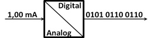

The electrical signal is called an analog signal as it can take any value (the number of digits after the decimal point is in theory infinitely long).

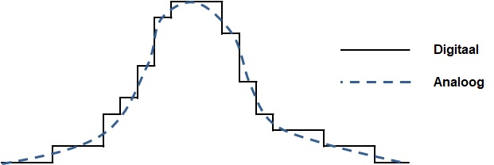

However, in automated systems one will define digital and analog signals according to the different states of the electrical signal:
- Electrical signals with stepless state between 2 extreme limits, which are converted into a series of “0” and “1” and are called **analog input signals**
- Electrical signals with 2 states that are converted to a logic “0” or a logic “1” are called **digital input signals**

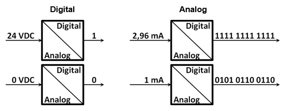

### Analog sensors
Within the EU, electrical input signals are determined by standards and guidelines. The list below provides an overview of commonly used electrical signals in automated systems:
- 24 VDC & 0 VDC for digital signals
- 0 .. 20 mA / 4 .. 20 mA / -20 .. +20 mA for analog current signals
- 0 .. 10 V / -10 .. + 10 V for analog tension signals
- Pt100 resistor measurement for analog temperature signals

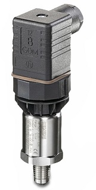
_Siemens SITRANS P200 Pressure sensor_

Because a digital signal changes stepwise, some information is lost during the conversion of analog input signals. In addition, analog input signals will always work between 2 extreme values, namely the min. and max. measuring limit. The difference between the max. limit and the min. limit is called the nominal measuring range.

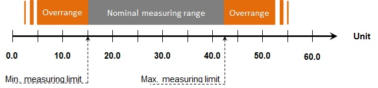

### Analog input modules
Analog sensors are processed by analog input modules or by analog inputs integrated into the CPU. Analog input modules are available in modules with 2, 4, or 8 analog inputs and are often indicated with the abbreviation **AI**.

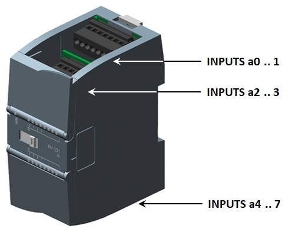

| Bit        | 15                 | 14    | 13   | 12   | 11   | 10   | 9   | 8   | 7   | 6  | 5  | 4  | 3  | 2  | 1  | 0  |
|-------------|--------------------|-------|------|------|------|------|-----|-----|-----|----|----|----|----|----|----|----|
| Weight     | S                  | 214   | 213  | 212  | 211  | 210  | 29  | 28  | 27  | 26 | 25 | 24 | 23 | 22 | 21 | 20 |
| Numeric | \+/-               | 16384 | 8192 | 4096 | 2048 | 1024 | 512 | 256 | 128 | 64 | 32 | 16 | 8  | 4  | 2  | 1  |

Typical for these modules:
- They produce a serie of 16 BITs. This is called a **WORD** and the combination is called "input word"
- An input word uses the datatype **INT** a can therefore create values between -32768 and +32767
- The measuring range is narrowed to -27648 and +27648 to allow a certain overrange
- Input modules come with a resolution which determines how many bits are used

| **Resolution in bits** | **Accuracy** | **Analog value**  |
| :-------------------: | :----------------: | :-----------------: |
| 8                     | 128                | S000 0000 1xxx xxxx |
| 9                     | 64                 | S000 0000 01xx xxxx |
| 10                    | 32                 | S000 0000 001x xxxx |
| 11                    | 16                 | S000 0000 0001 xxxx |
| 12                    | 8                  | S000 0000 0000 1xxx |
| 13                    | 4                  | S000 0000 0000 01xx |
| 14                    | 2                  | S000 0000 0000 001x |
| 15                    | 1                  | S000 0000 0000 0001 |

The "unused" BITs are showed with an x and have the value "0" in case of a positive number.
The influence ont the accuracy is showed in the figure below.

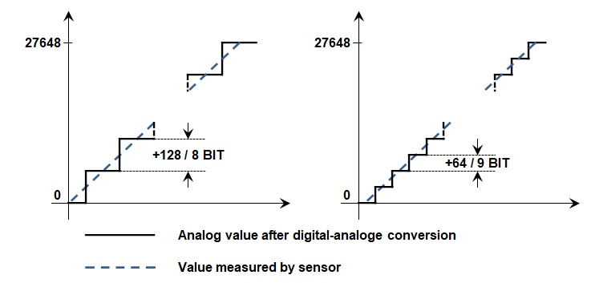

### Process analog inputs in software
It is advisable to convert analog values to the measuring unit of the sensor.
The table below shows de conversion of a Siemens SITRANS P200 pressure sensor with a measuring range from 0 .. 4 bar g and an electrical signal from 4 .. 20 mA.

|       | Sensor | Electrical signal | AD conversion |  Software REAL value |
| :---: | :---: | :---: | :---: | :---: |
| Max.  | 4 bar | 20 mA | 27648 | **4.0** "bar" |
| Measured value | 2 bar | 12 mA | 13824 | **2.0** "bar" |
| Min.  | 0 bar | 4 mA  | 0     | **0.0** "bar" |

Conversion of analog inputs is done by the **NORM_X** and the **SCALE_X** instruction.

The **NORM_X** instruction converts an INT number limited between a min. and a max. value to a REAL number between 0.0 and 1.0 (or 0% to 100%).

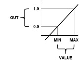

The **SCALE_X** instruction converts a REAL number limited between 0% and 100% to a REAL number between a min. and a max. value.

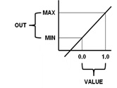

## Analog outputs
### Analog conversion
The processing unit will control the powers via the PLC outputs and the control circuit actuators. The digital signal from the processing unit is converted to an analog signal by the PLC output modules.

As with the sensors, the digital and analog signals will be defined on the basis of the different states of the electrical signal:
- Electrical signals with stepless state between 2 extreme limits, which are converted from a series of “0” and “1” and are called **analog output signals**
- Electrical signals with 2 states that are converted from a logic “0” or a logic “1” are called **digital output signals**

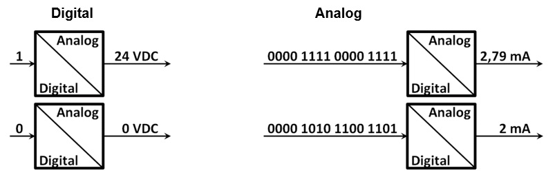

### Analog actuators
Within the EU, electrical input signals are determined by standards and guidelines. The list below provides an overview of commonly used electrical signals in automated systems:
- 24 VDC & 0 VDC for digital signals
- 0 .. 20 mA / 4 .. 20 mA / -20 mA .. + 20 mA for analog current signals
- 0 .. 10 V / -10 .. + 10V for analog tension signals

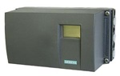
_Siemens SIPART PS2 Positioner_

### Analog output modules
Analog actuators are controlled by analog output modules or by analog outputs integrated into the CPU. Analog output modules are available in modules with 2, 4, or 8 analog outputs and are often indicated with the abbreviation **AO**.

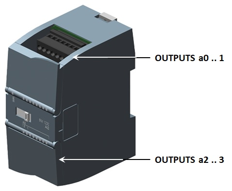

Typical for these modules:
- They process a serie of 16 BITs. This is called a **WORD** and the combination is called "output word"
- An output word uses the datatype **INT** a can therefore create values between -32768 and +32767
- The range is narrowed to -27648 and +27648 to allow a certain overrange
- Output modules come with a resolution which determines how many bits are used

### Process analog outputs in software
It is advisable to work with units (like %) in software and to convert these values to the output INT value.
The table below shows de conversion of a value between 0% and 100% to Siemens SIPART PS2 Posia with  an electrical signal from 4 .. 20 mA.

|       | Software REAL value | Electrical signal | AD conversion |  Actuator state |
| :---: | :---: | :---: | :---: | :---: |
| Max.  | 100 % | 20 mA | 27648 | **100%** "opened" |
| Software value | 50 % | 12 mA | 13824 | **50%** "half open" |
| Min.  | 0 % | 4 mA  | 0     | **0%** "closed" |

As with sensors is conversion of analog outnputs done by the **NORM_X** and the **SCALE_X** instruction.
