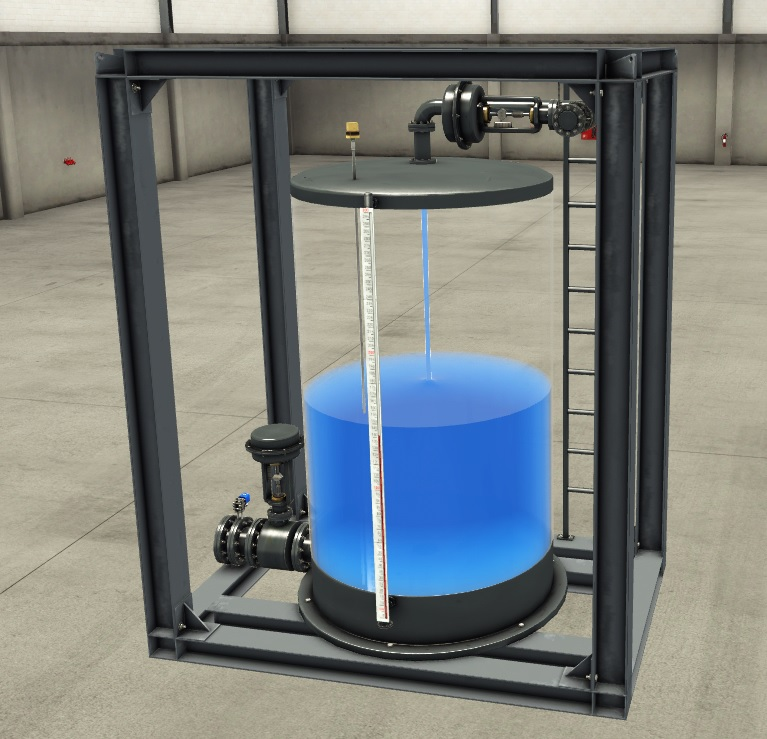

_____________________________________
# The watertank project
## Overview
-   The [first goal](Ex07/Subchapter04_01.md) is to program the AD conversion of an analog input
-   The [second goal](Ex07/Subchapter04_02.md) is to program a high level alarm control circuit
-   The [third goal](Ex07/Subchapter04_03.md) is to program start-stop control circuit
-   The [fourth goal](Ex07/Subchapter04_04.md) is to control the level
-   The [last goal](Ex07/Subchapter04_05.md) is to deliver a working project

## Scope
Automate the level in **watertank T1**. that is equipped with
- An analog level sensor
- An analog flow sensor on the outlet
- An analog inlet valve
- An analog outlet valve

Use the buttons, lamps, potentiometer and analog indicator on the ASTI PLC board to control the watertank.

## Characteristics
- Height: 3 m
- Diameter: 2 m
- Discharge pipe radius: 0.125 m
- Input flow: 0.25 m³/s
- Output flow: 0.3543 m³/s
