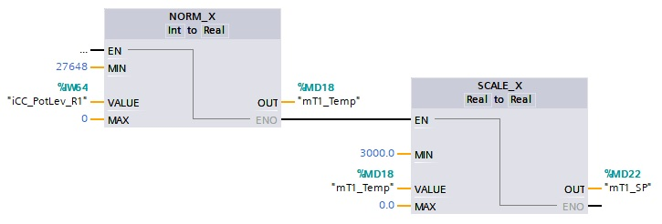
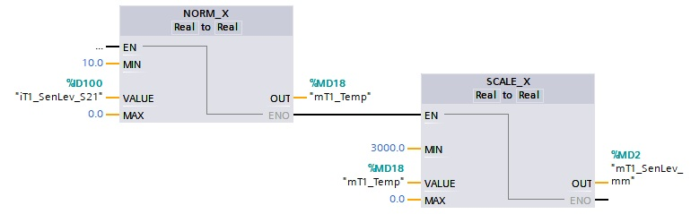

# The watertank project
_____________________________________
-   The [first goal](../Ex07/Subchapter04_01.md) is to program the AD conversion of an analog input
-   The [second goal](../Ex07/Subchapter04_02.md) is to program a high level alarm control circuit
-   The [third goal](../Ex07/Subchapter04_03.md) is to program start-stop control circuit
-   The [fourth goal](../Ex07/Subchapter04_04.md) is to control the level
-   The [last goal](../Ex07/Subchapter04_05.md) is to deliver a working project

Back to the [project scope](../Ex07/Subchapter04.md).

## Goal 1 : To program the AD conversion of an analog input
**Step 1 :** Create a new TIA Portal project
```javascript
Project name  : Ex7-Watertank
Author        : Your name
Comment       : The watertank project
```

**Step 2 :** Add a PLC-device with next CPU settings
```javascript
Type                          : See available CPU
System byte                   : %MB254
Clock memory byte             : %MB255
Digital input start address   : %IB0
Output start address          : %QB0
Analog input start address    : %IB64
IP-address                    : 192.168.0.30
IP-address subnet mask        : 255.255.255.0
```

**Step 3 :** Add next *Functions* (FC) into PLC_1 in the FBD program language:
```javascript
FC_CC
FC_T1
```

**Step 4 :** Add both the Functions into *Organization block* Main [OB1]:
```javascript
FC_CC into network 1
FC_T1 into network 2
```

**Step 5 :** Create the necessary PLC Tags:
```javascript
//Inputs
iCC_BtnStop_S1 - BOOL - %I 0.0 - Stop button
iCC_BtnStart_S3 - BOOL - %I 0.2 - Start button
iCC_BtnReset_S5 - BOOL - %I 0.4 - Reset button
iCC_PotLev_R1 - INT - %IW64 - Potentiometer level setpoint
iT1_SenLev_S21 - REAL - %ID100 - Level sensor tank T1
iT1_SenFlow_S22 - REAL - %ID104 - Flow sensor outlet tank T1

//Outputs
oCC_LmpStart_H1 - BOOL - %Q 0.0 - Lamp start
oCC_LmpErr_H3 - BOOL - %Q 0.2 - Lamp error
oT1_VlvIn_U21 - REAL - %QD100 - Inlet valve
oT1_VlvOut_U22 - REAL - %QD104 - Outlet valve

//Flags
mA001 - BOOL - %M 0.0 - Alarm high level exceeded
mA001_016 - WORD - %MW0 - Reserverd for alarms A001 to A016
mT1_SenLev_mm - REAL - %MD2 - Level tank 1 [mm]
mT1_FlowLev_ls - REAL - %MD6 - Flow outlet tank 1 [l/s]
mT1_VlvIn_perc - REAL - %MD10 - Inlet valve [%]
mT1_VlvOut_perc - REAL - %MD14 - Outlet valve [%]
mT1_Temp - REAL - %MD18 - Temporary value
mT1_SP - REAL - %MD22 - Level setpoint [mm]
mGenStarted - BOOL - %M 30.0 - Installation started
mT1_Fill - BOOL - %M 30.1 - Fill tank T1
```
**Step 5 :** Program the AD conversion of the potentiemeter in network 2 of FC_CC. The max. setpoint level is equal to the height of tank T1.



**Step 6 :** Program the AD conversion of the level sensor in network 1 of FC_T1. Do not forget to convert to mm!

**Remark: Factory IO uses the min. & max. REAL values 0.0 .. 10.0 instead of the INT values 0 .. 27648!**



**Step 7 :** Program the AD conversion of the flow sensor in network 2 of FC_T1. Do not forget to convert to liter/second!
