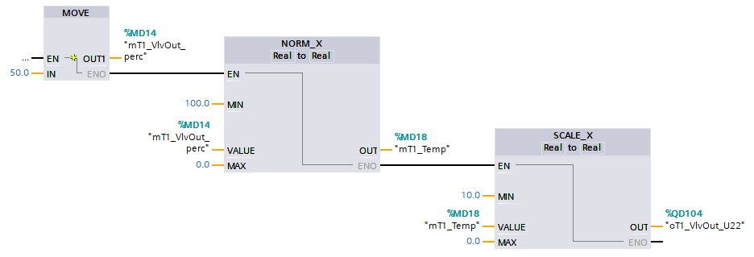

_____________________________________
# The watertank project
-   The [first goal](Ex07/Subchapter04_01.md) is to program the AD conversion of an analog input
-   The [second goal](Ex07/Subchapter04_02.md) is to program a high level alarm control circuit
-   The [third goal](Ex07/Subchapter04_03.md) is to program start-stop control circuit
-   The [fourth goal](Ex07/Subchapter04_04.md) is to control the level
-   The [last goal](Ex07/Subchapter04_05.md) is to deliver a working project

Back to the [project scope](Ex07/Subchapter04.md).

## Goal 4 : To control the level
**Step 1 :** Program in network 4 the level control. Activate the mT1_Fill flag if the level is for 5s or more lower than the setpoint.

```javascript
//Used Tags in this step
mT1_SenLev_mm - REAL - %MD2 - Level tank 1 [mm]
mT1_SP - REAL - %MD22 - Level setpoint [mm]
mGenStarted - BOOL - %M 30.0 - Installation started
mT1_Fill - BOOL - %M 30.1 - Fill tank T1
```

```javascript
TON_Timer.[mT1_SenLev_mm < mT1_SP] AND mGenStarted := mT1_Fill

```

**Step 2 :** Program in network 5 the inlet valve control.
- Control the % of the inlet valve (use the MOVE instruction)
- Open the valve for 70% if the installation is started AND T1 fill control is activate AND there is no high level alarm
- In any other case close the valve to 0%

```javascript
//Used Tags in this step
mT1_VlvIn_perc - REAL - %MD10 - Inlet valve [%]
mT1_Temp - REAL - %MD18 - Temporary value
oT1_VlvIn_U21 - REAL - %QD100 - Inlet valve
```

**Step 3 :** Program in network 6 the DA conversion of the inlet valve control.

```javascript
//Used Tags in this step
mA001 - BOOL - %M 0.0 - Alarm high level exceeded
mGenStarted - BOOL - %M 30.0 - Installation started
mT1_Fill - BOOL - %M 30.1 - Fill tank T1
mT1_VlvIn_perc - REAL - %MD10 - Inlet valve [%]
```

**Step 4 :** Program in network 4 the DA conversion of the outlet valve control. This valve is always open for 50%.



**Step 5 :** Download the software and test the level control.
